# **KS0345 Electronic Scale Kit for Arduino**

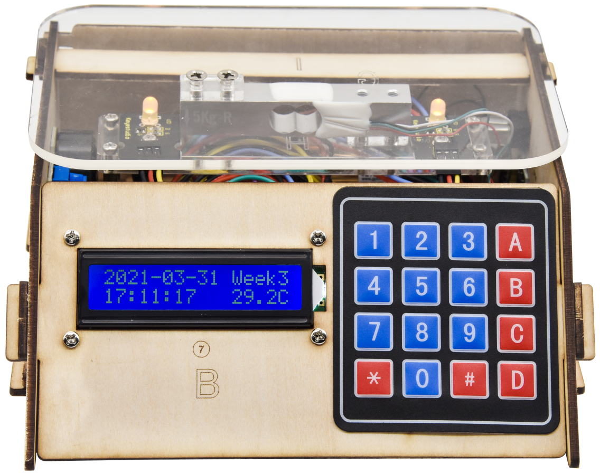

## 1.Description：

When it comes to programming, many think it difficult. However, KEYES group
rolls out an electronic scale kit to cope with this problem.

This is a low-cost, easy-to-build and open source programming kit.

In fact, it integrates a large number sensors and modules. You can absorb the
basic knowledge of programming like electronics, control logic, computer and

science from practical installation.

In compliance with the tutorial, an electronic scale can be produced by boards,
slot connection and wiring.

It also has a membrane keypad, a weighing sensor, a DS3231 module and an LCD
1602 display module Furthermore, the detailed projects will guide you to learn
the working principle of sensors and modules.

If interested in STEM and code programming, you can customize your

own scale by altering code and adding extra modules.

That sounds entertaining, right? Let’s get started!

## 2.Features:

1\.Multi-purpose function：key input and control，1602 display，weighing，counting，calculating price，alarm clock，temperature and time display

2\.Easy to build：Slot connection and without soldering circuit

3\.Novel style**：**Adopt strong wood board, acrylic board, RGB and LCD 1602
    modules.

4\.High extension：preserve IIC, UART, SPI ports，and extend other sensors
    and modules.

5\.Basic programming learning：use C language and code.

## 3.Parameters：

Input Voltage：7-12V

Working Voltage：5V

Working Current：100mA

Maximum consumption power：1.5W

## 4.Kit list：

| \# | Picture                                                                                                                                                                             | Model                                                                                                                                                                                                                                                                                                                                                                                                                                                                                                                                                                                                                                                                                                                                                                                                                                                                                                                                                                                                                                                                                                                                                                                                       | QTY |
|----|-------------------------------------------------------------------------------------------------------------------------------------------------------------------------------------|-------------------------------------------------------------------------------------------------------------------------------------------------------------------------------------------------------------------------------------------------------------------------------------------------------------------------------------------------------------------------------------------------------------------------------------------------------------------------------------------------------------------------------------------------------------------------------------------------------------------------------------------------------------------------------------------------------------------------------------------------------------------------------------------------------------------------------------------------------------------------------------------------------------------------------------------------------------------------------------------------------------------------------------------------------------------------------------------------------------------------------------------------------------------------------------------------------------|-----|
| 1  | 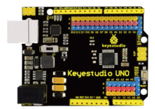                                                                                                                                     | Keyestudio Main Board                                                                                                                                                                                                                                                                                                                                                                                                                                                                                                                                                                                                                                                                                                                                                                                                                                                                                                                                                                                                                                                                                                                                                                                       | 1   |
| 2  | 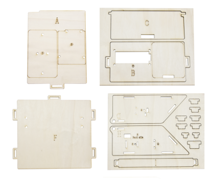                                                                                                                                     | 4pcs Wooden Boards                                                                                                                                                                                                                                                                                                                                                                                                                                                                                                                                                                                                                                                                                                                                                                                                                                                                                                                                                                                                                                                                                                                                                                                          | 1   |
| 3  | 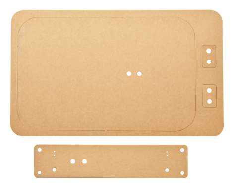                                                                                                                                     | 2pcs Acrylic Boards                                                                                                                                                                                                                                                                                                                                                                                                                                                                                                                                                                                                                                                                                                                                                                                                                                                                                                                                                                                                                                                                                                                                                                                         | 1   |
| 4  | 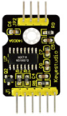                                                                                                                                     | Keyestudio HX711 Weighing Module                                                                                                                                                                                                                                                                                                                                                                                                                                                                                                                                                                                                                                                                                                                                                                                                                                                                                                                                                                                                                                                                                                                                                                            | 1   |
| 5  | 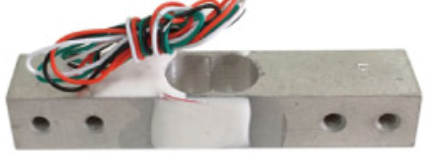                                                                                                                                     | Micro Weighing Sensor                                                                                                                                                                                                                                                                                                                                                                                                                                                                                                                                                                                                                                                                                                                                                                                                                                                                                                                                                                                                                                                                                                                                                                                       | 1   |
| 6  | 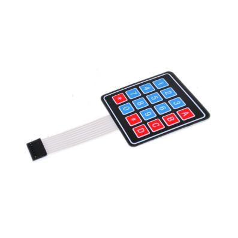                                                                                                                            |  4\*4 Membrane Keypad                                                                                                                                                                                                                                                                                                                                                                                                                                                                                                                                                                                                                                                                                                                                                                                                                                                                                                                                                                                                                                                                                                                                                                                       | 1   |
| 7  | 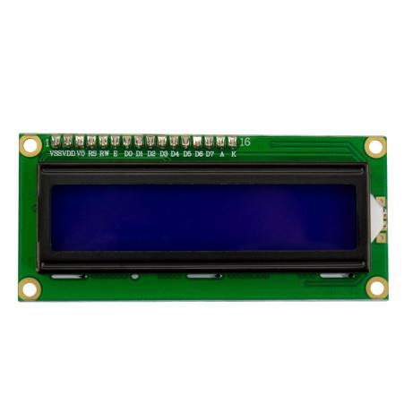                                                                                                                              | Keyestudio I2C1602 LCD Module                                                                                                                                                                                                                                                                                                                                                                                                                                                                                                                                                                                                                                                                                                                                                                                                                                                                                                                                                                                                                                                                                                                                                                               | 1   |
| 8  | 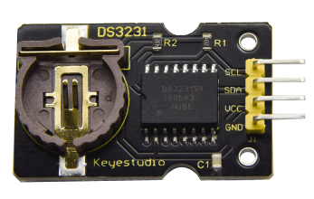                                                                                                                                | Keyestudio DS3231 Clock Module                                                                                                                                                                                                                                                                                                                                                                                                                                                                                                                                                                                                                                                                                                                                                                                                                                                                                                                                                                                                                                                                                                                                                                              | 1   |
| 9  | 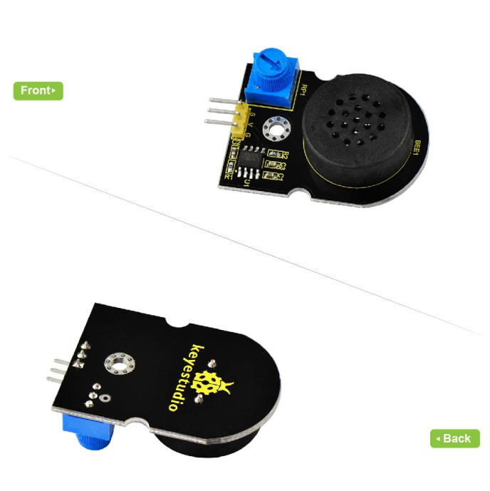                                                                                                                            |   keyestudio Power Amplifier Module | 1   |
| 10 | 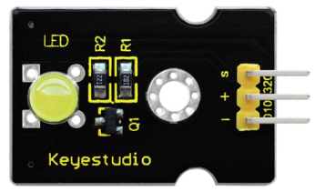                                                                                                                                     | Keyestudio Yellow LED Module                                                                                                                                                                                                                                                                                                                                                                                                                                                                                                                                                                                                                                                                                                                                                                                                                                                                                                                                                                                                                                                                                                                                                                                | 2   |
| 11 | 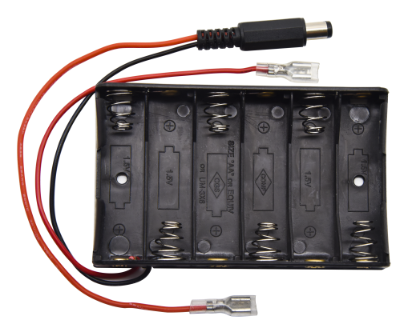                                                                                                                              | 6-slot AA Battery Holder                                                                                                                                                                                                                                                                                                                                                                                                                                                                                                                                                                                                                                                                                                                                                                                                                                                                                                                                                                                                                                                                                                                                                                                    | 1   |
| 12 | 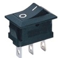                                                                                                                                     | 3-pin Rocket Switch                                                                                                                                                                                                                                                                                                                                                                                                                                                                                                                                                                                                                                                                                                                                                                                                                                                                                                                                                                                                                                                                                                                                                                                         | 1   |
| 13 |                                                                                                                                      | 50g Balance Wight                                                                                                                                                                                                                                                                                                                                                                                                                                                                                                                                                                                                                                                                                                                                                                                                                                                                                                                                                                                                                                                                                                                                                                                           | 1   |
| 14 |                                                                                                                                      | Dual-pass M3\*8MM Copper Pillar                                                                                                                                                                                                                                                                                                                                                                                                                                                                                                                                                                                                                                                                                                                                                                                                                                                                                                                                                                                                                                                                                                                                                                             | 8   |
| 15 | 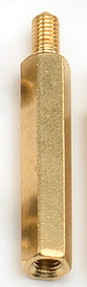                                                                                                                                     | Dual-pass M3\*40MM Copper Pillar                                                                                                                                                                                                                                                                                                                                                                                                                                                                                                                                                                                                                                                                                                                                                                                                                                                                                                                                                                                                                                                                                                                                                                            | 4   |
| 16 |                                                                                                                                      | M3\*6MM Round Head Screws                                                                                                                                                                                                                                                                                                                                                                                                                                                                                                                                                                                                                                                                                                                                                                                                                                                                                                                                                                                                                                                                                                                                                                                   | 8   |
| 17 |                                                                                                                                      | M3\*8MM Round Head Screws                                                                                                                                                                                                                                                                                                                                                                                                                                                                                                                                                                                                                                                                                                                                                                                                                                                                                                                                                                                                                                                                                                                                                                                   | 13  |
| 18 |                                                                                                                                      | M3\*10MM Round Head Screws                                                                                                                                                                                                                                                                                                                                                                                                                                                                                                                                                                                                                                                                                                                                                                                                                                                                                                                                                                                                                                                                                                                                                                                  | 3   |
| 19 | 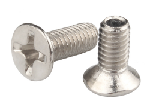                                                                                                                                     | M3\*6MM Flat Head Screws                                                                                                                                                                                                                                                                                                                                                                                                                                                                                                                                                                                                                                                                                                                                                                                                                                                                                                                                                                                                                                                                                                                                                                                    | 11  |
| 20 | 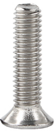                                                                                                                                     | M4\*12MM Flat Head Screws                                                                                                                                                                                                                                                                                                                                                                                                                                                                                                                                                                                                                                                                                                                                                                                                                                                                                                                                                                                                                                                                                                                                                                                   | 5   |
| 21 | 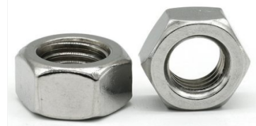                                                                                                                                     | M3 Nickel Plated Nuts                                                                                                                                                                                                                                                                                                                                                                                                                                                                                                                                                                                                                                                                                                                                                                                                                                                                                                                                                                                                                                                                                                                                                                                       | 11  |
| 22 |                                                                                                                                      | 3.0\*40MM Screwdriver                                                                                                                                                                                                                                                                                                                                                                                                                                                                                                                                                                                                                                                                                                                                                                                                                                                                                                                                                                                                                                                                                                                                                                                       | 1   |
| 23 | 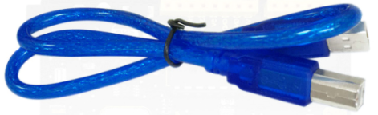                                                                                                                                     | AM/BM OD:5.0 L=50cm USB Cable                                                                                                                                                                                                                                                                                                                                                                                                                                                                                                                                                                                                                                                                                                                                                                                                                                                                                                                                                                                                                                                                                                                                                                               | 1   |
| 24 |                                                                                                                                      | 8MM Winding Pipe                                                                                                                                                                                                                                                                                                                                                                                                                                                                                                                                                                                                                                                                                                                                                                                                                                                                                                                                                                                                                                                                                                                                                                                            | 1   |
| 25 | 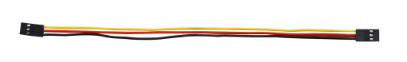                     | 3P F-F Dupont Line                                                                                                                                                                                                                                                                                                                                                                                                                                                                                                                                                                                                                                                                                                                                                                                                                                                                                                                                                                                                                                                                                                                                                                                          | 3   |
| 26 |                                                                                                     | 4P-1P F-F Black/Red/Blue/Green Dupont Line                                                                                                                                                                                                                                                                                                                                                                                                                                                                                                                                                                                                                                                                                                                                                                                                                                                                                                                                                                                                                                                                                                                                                                  | 1   |
| 27 |                                                                                                     | 4P-1P F-F Black/Green/Blue /Red Dupont Line                                                                                                                                                                                                                                                                                                                                                                                                                                                                                                                                                                                                                                                                                                                                                                                                                                                                                                                                                                                                                                                                                                                                                                 | 1   |
| 28 | 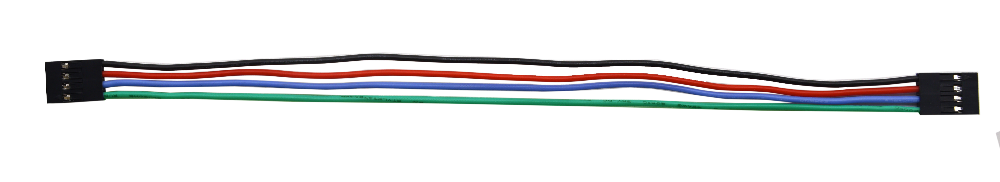                 | 4P Dupont Line                                                                                                                                                                                                                                                                                                                                                                                                                                                                                                                                                                                                                                                                                                                                                                                                                                                                                                                                                                                                                                                                                                                                                                                              | 1   |
| 29 | 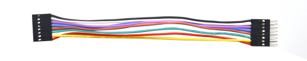 | 8P M-F Dupont Line                                                                                                                                                                                                                                                                                                                                                                                                                                                                                                                                                                                                                                                                                                                                                                                                                                                                                                                                                                                                                                                                                                                                                                                          | 1   |
| 30 | 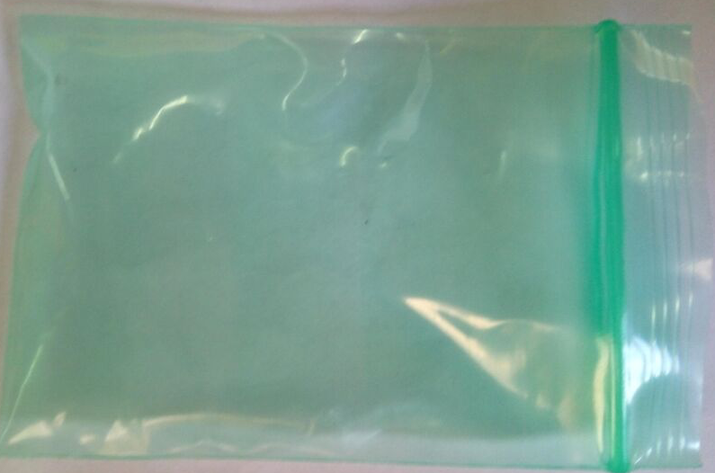                                                                                                                                     | 50\*82\*0.2MM Plastic Bag                                                                                                                                                                                                                                                                                                                                                                                                                                                                                                                                                                                                                                                                                                                                                                                                                                                                                                                                                                                                                                                                                                                                                                                   | 6   |
| 31 |                                                                                                                                      | 63\*106\*0.2MM Plastic Bag                                                                                                                                                                                                                                                                                                                                                                                                                                                                                                                                                                                                                                                                                                                                                                                                                                                                                                                                                                                                                                                                                                                                                                                  | 1   |
| 32 | 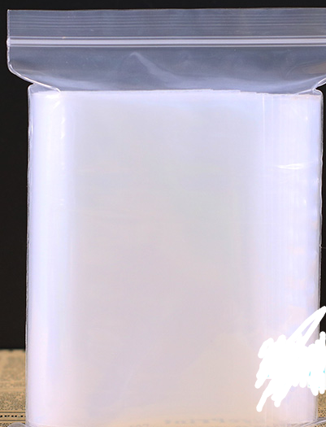                                                                                                                                     | 4CC 4\*6CM Plastic Bag                                                                                                                                                                                                                                                                                                                                                                                                                                                                                                                                                                                                                                                                                                                                                                                                                                                                                                                                                                                                                                                                                                                                                                                      | 8   |
| 33 |                                                                                                                                      | 4CC 10\*15CM Plastic Bag                                                                                                                                                                                                                                                                                                                                                                                                                                                                                                                                                                                                                                                                                                                                                                                                                                                                                                                                                                                                                                                                                                                                                                                    | 1   |

## 5.Getting Started with Arduino

**KeyestudioDevelopment Board**

**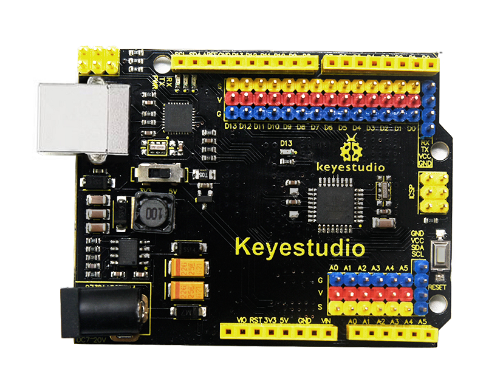**

This board has an ATMEGA16U2 chip which can be UART-to-USB conversion plug.

It has 14 digital input/output pins (of which 6 can be used as PWM outputs), 6
analog inputs, a 16 MHz crystal oscillator, a USB connection, a power jack, 1
ICSP headers, and a reset button.

It controls the microcontroller. You can use it by connecting it to computer.

| **Microcontroller**             | ATMEGA328P-AU                                            |
|---------------------------------|----------------------------------------------------------|
| **Operating Voltage**           | 5V                                                       |
| **Input Voltage (recommended)** | DC7-12V                                                  |
| **Digital I/O Pins**            | 14个 (D0-D13)                                            |
| **PWM Digital I/O Pins**        | 6个 (D3，D5，D6，D9，D10，D11)                           |
| **Analog Input Pins**           | 6 (A0-A5)                                                |
| Flash Memory                    | 32 KB (ATMEGA328P-PU) of which 0.5 KB used by bootloader |
| SRAM                            | 2 KB (ATMEGA328P-PU)                                     |
| EEPROM                          | 1 KB (ATMEGA328P-PU)                                     |
| Clock Speed                     | 16 MHz                                                   |

Element and Interfaces:

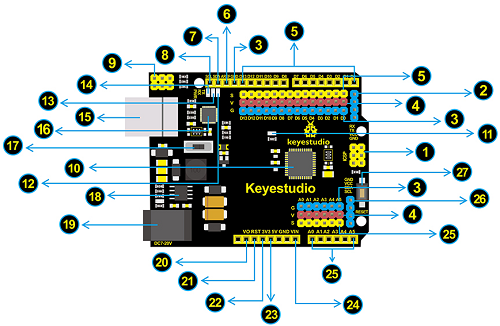

|    | **ICSP (In-Circuit Serial Programming) Header** ICSP is the AVR, an Arduino micro-program header consisting of MOSI, MISO, SCK, RESET, VCC, and GND. It is often called the SPI (serial peripheral interface) and can be considered an "extension" of the output. In fact, slave the output devices under the SPI bus host. When connecting to PC, program the firmware to ATMEGA328P-AU.                                                                                           |
|---------------------------------------------------|-------------------------------------------------------------------------------------------------------------------------------------------------------------------------------------------------------------------------------------------------------------------------------------------------------------------------------------------------------------------------------------------------------------------------------------------------------------------------------------|
|    | **Serial Communication Pin** Connect to serial communication.  4Pins (GND, VCC (3.3V or 5V controlled by slide switch), RX, TX)                                                                                                                                                                                                                                                                                                                                                     |
|    | **GND**  Ground pins                                                                                                                                                                                                                                                                                                                                                                                                                                                                |
|    | **V Pins (VCC)** Power the external sensors and modules. Select the voltage of 3.3V or 5V via a slide switch.                                                                                                                                                                                                                                                                                                                                                                       |
|    | **Digital I/O** It has 14 digital input/output pins, labeled D0 to D13 (of which 6 can be used as PWM outputs). These pins can be configured as digital input pin to read the logic value (0 or 1). Or used as digital output pin to drive different modules like LED, relay, etc. The pin D3, D5, D6, D9, D10, and D11 can be used to generate PWM.  For digital port, you can connect through female headers, or through pin headers (labeled S) of 2.54mm pitch.                 |
|    | **AREF**  For Analog reference. Sometimes used to set an external reference voltage (0-5V) as the upper limit of analog input pins.                                                                                                                                                                                                                                                                                                                                                 |
|    | **SDA** IIC communication pin                                                                                                                                                                                                                                                                                                                                                                                                                                                       |
|    | **SCL** IIC communication pin                                                                                                                                                                                                                                                                                                                                                                                                                                                       |
|    | **ICSP (In-Circuit Serial Programming) Header** ICSP is an AVR, an Arduino micro-program header consisting of MOSI, MISO, SCK, RESET, VCC, and GND. Connected to ATMEGA 16U2-MU. When connecting to PC, program the firmware to ATMEGA 16U2-MU.                                                                                                                                                                                                                                     |
|    | **Microcontroller**  Each control board has its own microcontroller. You can regard it as the brain of your board. Microcontrollers are usually from ATMEL. Before you load a new program on the Arduino IDE, you must know what IC is on your board. This information can be checked at the top of IC. The microcontroller used in this board is [ATMEGA328P-AU](http://ww1.microchip.com/downloads/en/DeviceDoc/Atmel-7810-Automotive-Microcontrollers-ATmega328P_Datasheet.pdf). |
|    | **D13 LED**  There is a built-in LED driven by digital pin 13. When the pin is HIGH value, the LED is on, when the pin is LOW, it's off.                                                                                                                                                                                                                                                                                                                                            |
|    | **TX LED** Onboard you can find the label: TX (transmit) When the board communicates via serial port, send the message, TX led flashes.                                                                                                                                                                                                                                                                                                                                             |
|    | **RX LED** Onboard you can find the label: RX(receive ) When the board communicates via serial port, receive the message, RX led flashes.                                                                                                                                                                                                                                                                                                                                           |
|    | **Power LED** LED on means that your circuit board is correctly powered on. Otherwise LED is off.                                                                                                                                                                                                                                                                                                                                                                                   |
|    | **USB Connection** You can power the board via USB connection. Or can upload the program to the board via USB port. Connect the board to PC using a USB cable via USB port.                                                                                                                                                                                                                                                                                                         |
|    | **ATMEGA 16U2-MU**  USB to serial chip, can convert the USB signal into serial port signal.                                                                                                                                                                                                                                                                                                                                                                                         |
|    | **Slide Switch** You can slide the switch to control the voltage of pin V (VCC), 3.3V or 5V.                                                                                                                                                                                                                                                                                                                                                                                        |
|    | **Voltage Regulator** To control the voltage provided to the board, as well as to stabilize the DC voltage used by the processor and other components. Convert an external input DC7-12V voltage into DC 5V, then switch DC 5V to the processor and other components, output DC 5V, drive current is 2A.                                                                                                                                                                            |
|    | **DC Power Jack** The board can be supplied with an external power DC7-12V from the DC power jack.                                                                                                                                                                                                                                                                                                                                                                                  |
|    | **IOREF**  Used to configure the operating voltage of microcontrollers. Use it less.                                                                                                                                                                                                                                                                                                                                                                                                |
|    | **RESET Header**  Connect an external button to reset the board. The function is the same as reset button.                                                                                                                                                                                                                                                                                                                                                                          |
|    | **Pin 3V3 Output** Provides 3.3V voltage output                                                                                                                                                                                                                                                                                                                                                                                                                                     |
|    | **Pin 5V Output** Provides 5V voltage output                                                                                                                                                                                                                                                                                                                                                                                                                                        |
|    | **Vin**  You can supply an external voltage input DC7-12V through this pin to the board.                                                                                                                                                                                                                                                                                                                                                                                            |
|    | **Analog Pins** The board has 6 analog inputs, labeled A0 through A5.  Can also used as digital pins, A0=D14, A1=D15, A2=D16, A3=D17, A4=D18, A5=D19. For analog port, you can connect through female headers, or through pin headers (labeled S) of 2.54mm pitch.                                                                                                                                                                                                                  |
|    | **IIC Communication Pin** Connect to the IIC communication.  4Pins (GND, VCC (3.3V or 5V controlled by slide switch), SDA, SCL)                                                                                                                                                                                                                                                                                                                                                     |
|    | **RESET Button** You can reset your board to start the program from the initial status.                                                                                                                                                                                                                                                                                                                                                                                             |

**Getting Started with Arduino**

1.  **Installing Arduino IDE**

When we get control board, we need to download Arduino IDE and driver firstly.

You could download Arduino IDE from the official website:

<https://www.arduino.cc/>, click the **SOFTWARE** on the browse bar,
click“DOWNLOADS” to enter download page, as shown below:

You can download either Windows win7 and newer or Windows ZIP file.

The first one doesn’t require

There are two versions of IDE for WINDOWS system, you can choose from the
Installer (.exe) and the Zip packages. We suggest you use the first one that
installs directly everything you need to use the Arduino Software (IDE),
including the drivers.

With the Zip package you need to install the drivers manually. The Zip file is
also useful if you want to create a portable installation.

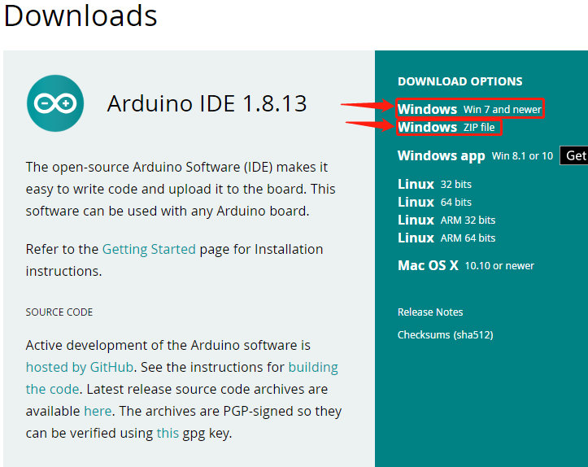

You just need to click JUST DOWNLOAD.

1.  **Installing Driver**

**Windows 10:**

The driver will be automatically installed if you plug control board to your
computer. Then the COM port is show below:

![2J]GJ2SFG}V)XUO3UB@RKOI](media/92a17f30a269e76265603a45c3283c87.png)

You need to install it manually if your computer is other Windows system.

We will take win7 system as example.

Right-click  and click **Open
file location** to find out the **drivers folder**

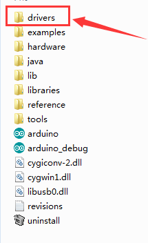

Copy driver folder to D drive.

Right click Computer----- Properties----- Device Manager

You will view **Unknown Device**

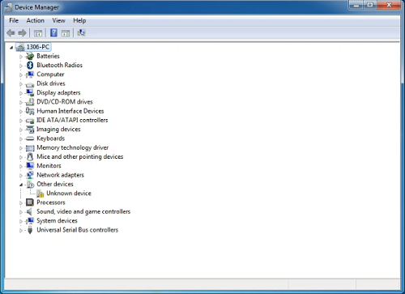

Click **Unknown devices** to select **Update Device Management**

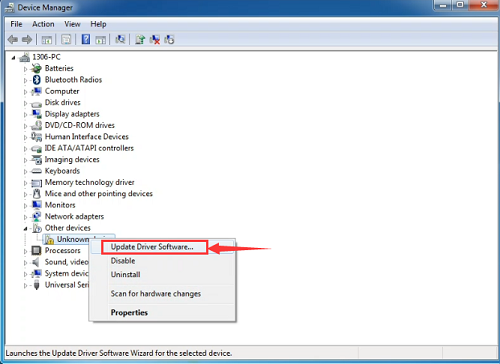

Click“Browse.....manually”

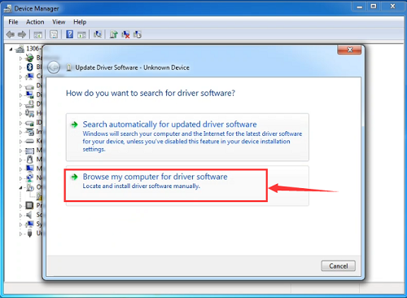

Find the“drivers”file，and tap“Next”.

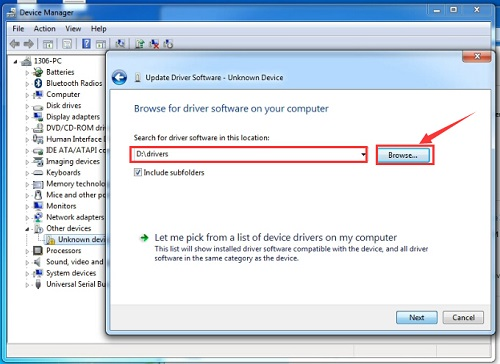

Click“install this driver software anyway”

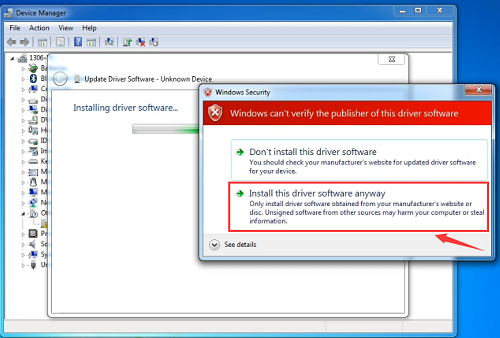

Then click“Close”and check the serial port.

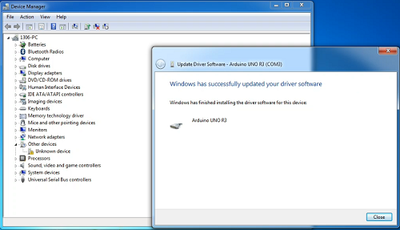

Return to Device Manager page if the driver is installed. Then check correct
port

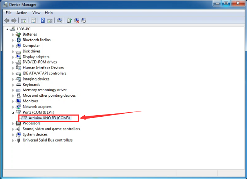

(3) Arduino IDE Setting

Clickicon，and open Arduino IDE.

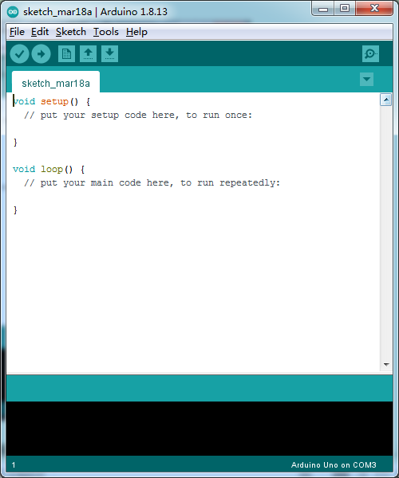

To avoid the errors when uploading the program to the board, you need to select
the correct Arduino board that matches the board connected to your computer.

Then come back to the Arduino software, you should click Tools→Board, select the
board. (as shown below)

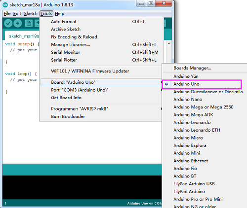

Then select the correct COM port (you can see the corresponding COM port after
the driver is successfully installed).

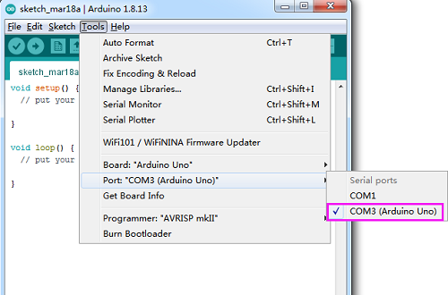

Before uploading the program to the board, let’s demonstrate the function of
each symbol in the Arduino IDE toolbar.

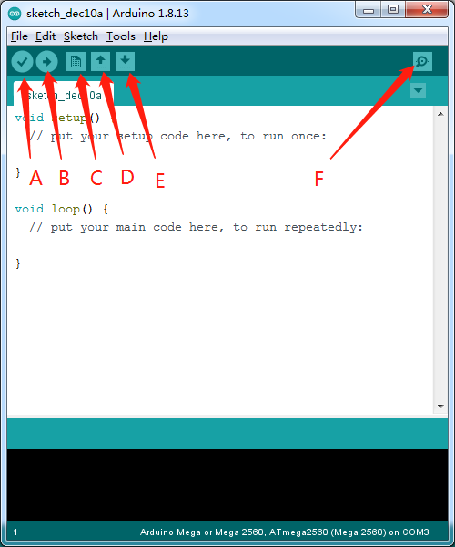

A- Used to verify whether there is any compiling mistakes or not.

B- Used to upload the sketch to your Arduino board.

C- Used to create shortcut window of a new sketch.

D- Used to directly open an example sketch.

E- Used to save the sketch.

F- Used to send the serial data received from board to the serial monitor.

(4) Start your first program

We’ve known how to download and install the driver of development board , next,
we will burn a code to show“Hello World！”in the monitor.

void setup() {

// initialize serial communication at 9600 bits per second:

Serial.begin(9600);

}

void loop() {

// print out "Hello world!"

Serial.println("Hello world!");

delay(1000);// delay 1 second

}

Then let’s make monitor show Hello World！

Open Arduino IDE, and select **Arduino UNO**

Set COM port, as shown below:

Clickto start compiling the
program, and check errors.

Clickto upload the program,
upload successfully.

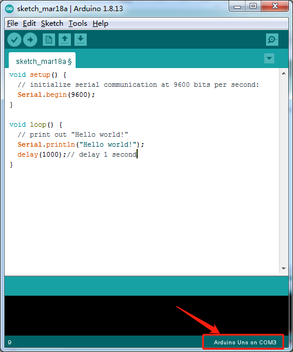

Upload the program successfully, open serial monitor and set baud rate to 9600.
Monitor will print“Hello World!”each 1s.

Congratulation, you finish the first program.

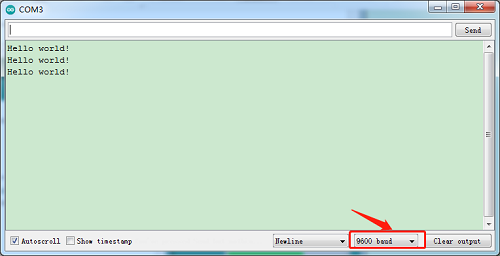

## 6.Projects

The whole project begins with basic program. Starting from simple to complex,
the lessons will guide you to assemble smart motorhome and absorb the knowledge
of electronic and machinery step by step.

Note: (G), marked on each sensor and module, is negative pole and connected
to“G”,“-”or“GND”on the sensor shield or control board ; (V) is positive pole and
interfaced with“V”,“VCC”,“+”or“5V”on the sensor shield or control board.

### Project 1: LED Blink

  **Description：**

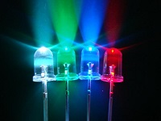

For the starter and enthusiast, this is a fundamental program---LED Blink.

LED, the abbreviation of light emitting diodes, consist of Ga, As, P, N chemical
compound and so on. It is often applied to numbers and text display as an
indicator in the circuit.

The LED can flash diverse color by altering the delay time in the test code.
When in control, power on GND and VCC, the LED will be on if S end is high
level; nevertheless, it will go off.

**(2) Parameter：**

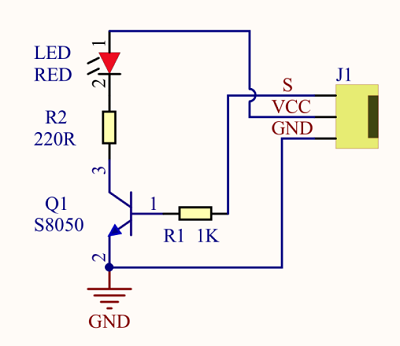

-   Control interface: digital port

-   Working voltage: DC 3.3-5V

-   Pin spacing: 2.54mm

-   LED display color: yellow

 (3) Component：

| Keyestudio Development Board\*1                      | Keyestudio Yellow LED Module\*1                 | 20cm 3pin F-F 26AWG Dupont Line\*1                                                                                                                              |
|------------------------------------------------------|-------------------------------------------------|-----------------------------------------------------------------------------------------------------------------------------------------------------------------|
|       |  |  |
| USB Cable\*1                                         |                                                 |                                                                                                                                                                 |
| 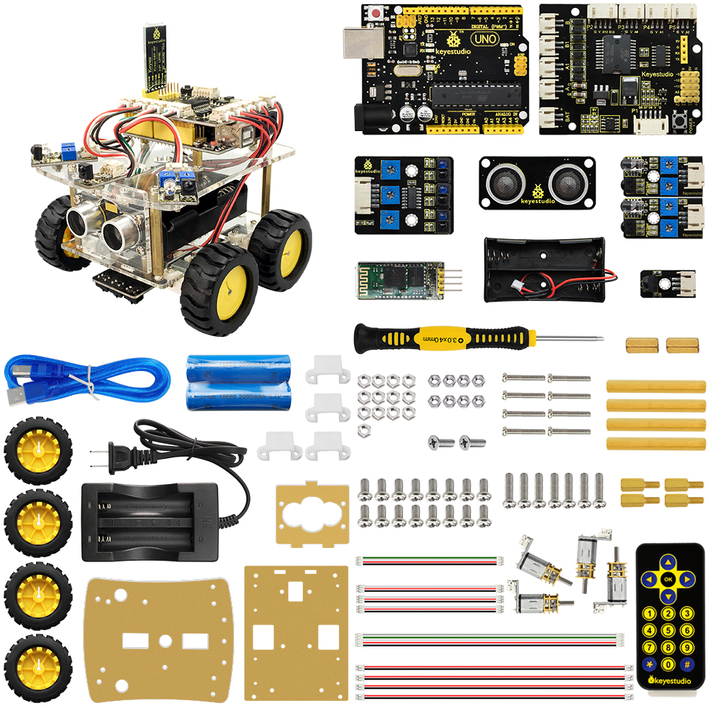 |                                                 |                                                                                                                                                                 |

 (4) Wiring Diagram：

The pin -, + and S of LED module are connected to the pin G, 5V and D10 port of
expansion board

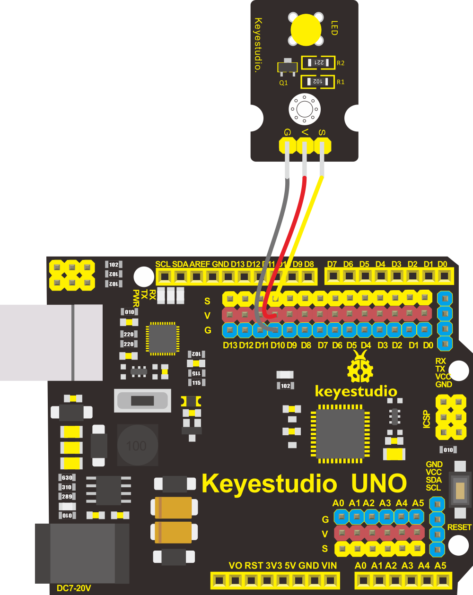

 Test Code：

**/\***

**keyestudio Electronic scale**

**lesson 1.1**

**Blink**

**http://www.keyestudio.com**

**\*/**

**\#define LED 10 // define a pin of LED as D10**

**void setup()**

**{**

**pinMode(LED, OUTPUT);// initialize digital pin LED as an output.**

**}**

**void loop() // the loop function runs over and over again forever**

**{**

**digitalWrite(LED, HIGH); // turn the LED on (HIGH is the voltage level**

**delay(1000); // wait for a second**

**digitalWrite(LED, LOW); // turn the LED off by making the voltage LOW**

**delay(1000); // wait for a second**

**}**

 Test Result：

Upload the program, LED blinks with the interval of 1s.

 Code Explanation:

**pinMode(LED，OUTPUT)** - This function can denote that the pin is INPUT or
OUTPUT.

**digitalWrite(LED，HIGH)** - When pin is OUTPUT, we can set it to HIGH(output
5V) or LOW(output 0V).

 Extension Practice：

The LED flashes for 1s through the test result, therefore, delay time can change
flash frequency.

**Test Code:**

**/\***

**keyestudio Electronic scale**

**lesson 1.2**

**Blink**

**http://www.keyestudio.com**

**\*/**

**\#define LED 10 //define a pin of LED as D10**

**void setup()**

**{**

**pinMode(LED, OUTPUT);// initialize digital pin LED as an output.**

**}**

**void loop() // the loop function runs over and over again forever**

**{**

**digitalWrite(LED, HIGH); // turn the LED on (HIGH is the voltage level**

**delay(100); // wait for a second**

**digitalWrite(LED, LOW); // turn the LED off by making the voltage LOW**

**delay(100); // wait for a second**

**}**

Upload code and observe the LED state

### **Project 2: Adjust LED Brightness**

 Description：

In previous lesson, we control LED on and off and make it blink.

In this project, we will control LED brightness through PWM to simulate
breathing effect. Similarly, you can change the step length and delay time in
the code so as to demonstrate different breathing effect.

PWM is a means of controlling the analog output via digital means. Digital
control is used to generate square waves with different duty cycles (a signal
that constantly switches between high and low levels) to control the analog
output.In general, the input voltage of port are 0V and 5V. What if the 3V is
required? Or what if switch among 1V, 3V and 3.5V? We can’t change resistor
constantly. For this situation, we need to control by PWM.

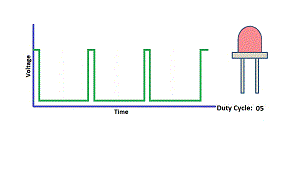

For the Arduino digital port voltage output, there are only LOW and HIGH, which
correspond to the voltage output of 0V and 5V. You can define LOW as 0 and HIGH
as 1, and let the Arduino output five hundred 0 or 1 signals within 1 second.

If output five hundred 1, that is 5V; if all of which is 1, that is 0V. If
output 010101010101 in this way then the output port is 2.5V, which is like
showing movie. The movie we watch are not completely continuous. It actually
outputs 25 pictures per second. In this case, the human can’t tell it, neither
does PWM. If want different voltage, need to control the ratio of 0 and 1. The
more 0,1 signals output per unit time, the more accurately control.

 Required Components：

| Keyestudio Main Board\*1                             | Keyestudio Yellow LED Module\*1                 | 20cm 3pin F-F 26AWG Dupont Line\*1                                                                                                                              |
|------------------------------------------------------|-------------------------------------------------|-----------------------------------------------------------------------------------------------------------------------------------------------------------------|
|       |  |  |
| USB Cable\*1                                         |                                                 |                                                                                                                                                                 |
|  |                                                 |                                                                                                                                                                 |

 Wiring Diagram：

The wiring diagram is as same as the project 1

 Test Code：

**/\***

**keyestudio Electronic scale**

**lesson 2.1**

**PWM**

**http://www.keyestudio.com**

**\*/**

**\#define LED 10 //define a pin of LED as D10**

**int value;**

**void setup()**

**{**

**pinMode(LED, OUTPUT);// initialize digital pin LED as an output.**

**}**

**void loop () {**

**for (value = 0; value \< 255; value = value + 1) {**

**analogWrite (LED, value); // LED lights gradually light up**

**delay (5); // delay 5MS**

**}**

**for (value = 255; value \> 0; value = value - 1) {**

**analogWrite (LED, value); // LED gradually goes out**

**delay (5); // delay 5MS**

**}**

**}**

 Test Result：

Upload test code successfully, LED gradually becomes brighter then darker, like
human breath.

 (6) Code Explanation

When we need to repeat some statements, we could use FOR statement.

FOR statement format is shown below:

FOR cyclic sequence:

Round 1：1 → 2 → 3 → 4

Round 2：2 → 3 → 4

…

Until number 2 is not established, “for”loop is over,

After knowing this order, go back to code:

**for (int value = 0; value \< 255; value=value+1){**

**...}**

**for (int value = 255; value \>0; value=value-1){**

**...}**

The two“for”statements make value increase from 0 to 255, then reduce from 255
to 0, then increase to 255,....infinitely loop

There is a new function in the following ----- analogWrite()

We know that digital port only has two state of 0 and 1. So how to send an
analog value to a digital value? Here,this function is needed. Let’s observe the
Arduino board and find 6 pins marked“\~”which can output PWM signals.

Function format as follows:

**analogWrite(pin,value)**

analogWrite() is used to write an analog value from 0\~255 for PWM port, so the
value is in the range of 0\~255. Attention that you only write the digital pins
with PWM function, such as pin 3, 5, 6, 9, 10, 11.

PWM is a technology to obtain analog quantity through digital method. Digital
control forms a square wave, and the square wave signal only has two states of
turning on and off (that is, high or low levels). By controlling the ratio of
the duration of turning on and off, a voltage varying from 0 to 5V can be
simulated. The time turning on(academically referred to as high level) is called
pulse width, so PWM is also called pulse width modulation.

Through the following five square waves, let’s acknowledge more about PWM.

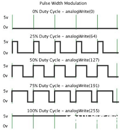

In the above figure, the green line represents a period, and value of
analogWrite() corresponds to a percentage which is called Duty Cycle as well.
Duty cycle implies that high-level duration is divided by low-level duration in
a cycle. From top to bottom, the duty cycle of first square wave is 0% and its
corresponding value is 0. The LED brightness is lowest, that is, turn off. The
more time high level lasts, the brighter the LED. Therefore, the last duty cycle
is 100%, which correspond to 255, LED is brightest. 25% means darker.

PWM mostly is used for adjusting the LED brightness or rotation speed of motor.

It plays vital role in controlling smart robot car. I believe that you can’t
wait to enter next project.

 (7) Extension Practice：

Let’s observe the status of LED if we change the delay value

**/\***

**keyestudio Electronic scale**

**lesson 2.2**

**PWM**

**http://www.keyestudio.com**

**\*/**

**\#define LED 10 // define a pin of LED as D10**

**int value;**

**void setup()**

**{**

**pinMode(LED, OUTPUT);// initialize digital pin LED as an output.**

**}**

**void loop () {**

**for (value = 0; value \< 255; value = value + 1) {**

**analogWrite (LED, value); // LED lights gradually light up**

**delay (20); // delay 20MS**

**}**

**for (value = 255; value \> 0; value = value - 1) {**

**analogWrite (LED, value); // LED gradually goes out**

**delay (20); // delay 20MS**

**}**

**}**

Upload code to development board, the LED’s blink frequency is slower, isn’t it?

### Project 3: 1602 LCD Display Module

 Description：

With I2C communication module, this is a display module that can show 2 lines
with 16 characters per line.

It shows blue background and white word and connects to I2C interface of MCU,
which highly save the MCU resources.

On the back of LCD display, there is a blue potentiometer for adjusting the
backlight. The communication address defaults to 0x27.

The original 1602 LCD can start and run with 7 IO ports, but ours is built with
ARDUINOIIC/I2C interface, saving 5 IO ports. Alternatively, the module comes
with 4 positioning holes with a diameter of 3mm, which is convenient for you to
fix on other devices.

 (2) Specification：

-   I2C address: 0x27

-   Backlight (blue, white)

-   Power supply voltage: 5V

-   Adjustable contrast

-   GND: A pin that connects to ground

-   VCC: A pin that connects to a +5V power supply

-   SDA: A pin that connects to analog port 20 for IIC communication

-   SCL: A pin that connects to analog port 21 for IIC communication

 (3) Component：

| Keyestudio Main Board\*1                                                                                                                                            | Keyestudio I2C1602 Display Module\*1                       | USB Cable \*1                                        |
|---------------------------------------------------------------------------------------------------------------------------------------------------------------------|------------------------------------------------------------|------------------------------------------------------|
|                                                                                                                      | 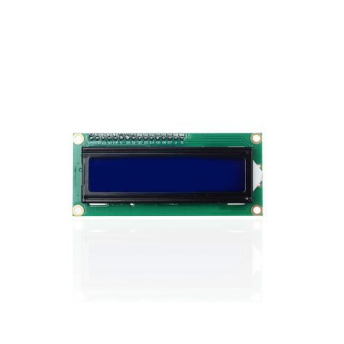 |  |
| 20cm 26AWG  4P-1P F-F Black/Red/Blue/Green Dupont Line                                                                                                              |                                                            |                                                      |
|  |                                                            |                                                      |

 (4) Wiring Diagram：

Note：the pin GND, VCC, SDA and SCL of 1602LCD module are connected to GND(-),
5V(+), SDA and SCL of IIC communication

 (5) Test Code：

**/\***

**keyestudio Electronic scale**

**Lesson_3.1**

**I2C 1602**

**http://www.keyestudio.com**

**\*/**

**\#include \<Wire.h\>**

**\#include \<LiquidCrystal_I2C.h\> // includes the LiquidCrystal_I2C Library**

**LiquidCrystal_I2C lcd(0x27, 16, 2); // set the LCD address to 0x27 for a 16
chars and 2 line display**

**void setup() {**

**lcd.init();**

**// Print a message to the LCD.**

**lcd.backlight(); //set backlight**

**lcd.setCursor(0,0); //set Cursor at(0,0)**

**lcd.print("Hello, World!"); //display "Hello, World!"**

**lcd.setCursor(0,1); //set Cursor at(0,1)**

**lcd.print("Hello, Keyes!"); //show "Hello, Keyes!"**

**}**

**void loop () {**

**}**

 Test Result：

Upload code, wire up according to connection diagram and power on. 1602 LCD will
display“Hello World！”at the first row and show“Hello Keyes！”at the second row.

Note: wire up connection diagram, upload code and power on. You can adjust the
potentiometer on the back of 1602LCD display module to display the character
strings

### 3 Project 4 Power Amplifier Module

 Description：

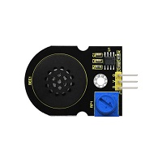

We can use Arduino to make many interactive works of which the most commonly
used is acoustic-optic display.

The circuit in this experiment can produce sound. Normally, the experiment is
done with a buzzer or a speaker while buzzer is simpler and easier to use. In
this project, this power amplifier module is equivalent to passive buzzer. It
can emit“do re mi fa so la si do”sound via code.

 Parameters：

Control Port: Digital port

Working Voltage: DC 5V

**(3) Required Components**

| Keyestudio Main Board\*1                             | Keyestudio Power Amplifier Module\*1                                | 20cm 3pin F-F 26AWG Dupont Line\*1                                                                                                                              |
|------------------------------------------------------|---------------------------------------------------------------------|-----------------------------------------------------------------------------------------------------------------------------------------------------------------|
|       | 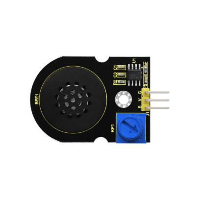 | 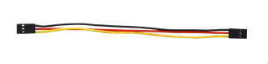 |
| USB Cable\*1                                         |                                                                     |                                                                                                                                                                 |
|  |                                                                     |                                                                                                                                                                 |

 (4) Wiring Diagram：

Note: The G, V and S of power amplifier module are separated to G, V and A0 of
expansion board


 (5) Test Code：

**//\*\*\*\*\*\*\*\*\*\*\*\*\*\*\*\*\*\*\*\*\*\*\*\*\*\*\*\*\*\*\*\*\*\*\*\*\*\*\*\*\*\*\*\*\*\*\*\*\*\*\*\*\*\*\*\*\*\*\*\*\*\*\*\*\*\*\*\*\*\*\*\*\***

**/\***

**keyestudio Electronic scale**

**Lesson_4.1**

**buzzer**

**http://www.keyestudio.com**

**\*/**

**const int buzzer A0 //buzzer pin to A0**

**void setup() {**

**pinMode(buzzer, OUTPUT);//set digital A0 to OUTPUT**

**}**

**void loop () {**

**tone(buzzer, 262); //Buzzer emits a sound with 262Hz**

**delay(250); //delay in 250ms**

**tone(buzzer, 294);; //Buzzer emits a sound with 262Hz**

**delay(250); //delay in 250ms**

**tone(buzzer, 330);**

**delay(250);**

**tone(buzzer, 349);**

**delay(250);**

**tone(buzzer, 392);**

**delay(250);**

**tone(buzzer, 440);**

**delay(250);**

**tone(buzzer, 494);**

**delay(250);**

**tone(buzzer, 532);**

**delay(250);**

**noTone(buzzer); // Output sound when buzzer turns off**

**delay(1000);**

**}**

 (6) Test Result：

Upload code to Keyestudio development board, power amplifier module will emit“do
re mi fa so la si do”.

 Extension Practice：play music

**/\***

**keyestudio Electronic scale**

**Lesson_4.2**

**buzzer**

**http://www.keyestudio.com**

**\*/**

**const int buzzer 13 //buzzer pin to D13**

**void setup() {**

**pinMode(buzzer, OUTPUT);//set digital 13 to OUTPUT**

**}**

**void loop () {**

**birthday();**

**}**

**////////////////////////Set Happy Birthday//////////////////////////////////**

**void birthday()**

**{**

**tone(buzzer, 294); //buzzer outputs a sound with 294Hz**

**delay(250);//delay in 250ms**

**tone(buzzer, 440);**

**delay(250);**

**tone(buzzer, 392);**

**delay(250);**

**tone(buzzer, 532);**

**delay(250);**

**tone(buzzer, 494);**

**delay(500);**

**tone(buzzer, 392);**

**delay(250);**

**tone(buzzer, 440);**

**delay(250);**

**tone(buzzer, 392);**

**delay(250);**

**tone(buzzer, 587);**

**delay(250);**

**tone(buzzer, 532);**

**delay(500);**

**tone(buzzer, 392);**

**delay(250);**

**tone(buzzer, 784);**

**delay(250);**

**tone(buzzer, 659);**

**delay(250);**

**tone(buzzer, 532);**

**delay(250);**

**tone(buzzer, 494);**

**delay(250);**

**tone(buzzer, 440);**

**delay(250);**

**tone(buzzer, 698);**

**delay(375);**

**tone(buzzer, 659);**

**delay(250);**

**tone(buzzer, 532);**

**delay(250);**

**tone(buzzer, 587);**

**delay(250);**

**tone(buzzer, 532);**

**delay(500);**

**}**

### Project 5: 4\*4 Membrane Keypad

 Description：

To save I/O ports of MCU, we make a Membrane Keypad. In this project, we will
make an experiment; serial monitor will display the corresponding character when
the membrane keypad is pressed.


**Schematic Diagram:**


 Specification：

-   Working Voltage: 3.3V\~5V

-   Port：digital port

 Component：

| Keyestudio Main Board\*1                             | Keyestudio 4\*4 Membrane Keypad\*1                          | 15cm 8pin M-F 26AWG Dupont Line \*1                                                                                                                                                 |
|------------------------------------------------------|-------------------------------------------------------------|-------------------------------------------------------------------------------------------------------------------------------------------------------------------------------------|
|       |  |  |
| USB Cable\*1                                         |                                                             |                                                                                                                                                                                     |
|  |                                                             |                                                                                                                                                                                     |

 Wiring Diagram：


 Test Code：

**/\***

**keyestudio Electronic scale**

**Lesson_5.1**

**Keypad**

**http://www.keyestudio.com**

**\*/**

**\#include \<Keypad.h\>**

**const byte ROWS = 4; //four rows**

**const byte COLS = 4; //four columns**

**char keypressed;**

**//define the cymbols on the buttons of the keypads**

**char keyMap[ROWS][COLS] = {**

**{'1', '2', '3', 'A'},**

**{'4', '5', '6', 'B'},**

**{'7', '8', '9', 'C'},**

**{'\*', '0', '\#', 'D'}**

**};**

**byte rowPins[ROWS] = {2, 3, 4,5}; //Row pinouts of the keypad**

**byte colPins[COLS] = {6, 7, 8, 9}; //Column pinouts of the keypad**

**Keypad myKeypad = Keypad( makeKeymap(keyMap), rowPins, colPins, ROWS, COLS);**

**void setup()**

**{**

**Serial.begin(9600); //Set baud rate to 9600**

**}**

**void loop ()**

**{**

**keypressed = myKeypad.getKey(); // read key values**

**if (keypressed != NO_KEY) { //read key values**

**Serial.print("key:");**

**Serial.println(keypressed); //print key values**

**}**

**}**

Download code to board, open serial monitor and set baud rate to 9600.

The monitor will show the corresponding key values when some keys are pressed,
as shown below;

 Test Result：

Download code, open serial monitor and set baud rate to 9600. The serial monitor
will show the corresponding key value when the key of membrane keypad is
pressed, as shown below;


### Project 6: DS3231 Clock Module：

 (1) Description：

Clock module can be displayed time and a timer. In this project, we will show
time and temperature with DS3231 module.

The clock operation can adopt 24 or 12 hour format through AM/PM indication.

High accuracy and inner temperature compensation of built-in crystal oscillator
makes less error. Also, it has automatic compensation for leap-years and for
months with fewer than 31 days.

The clock operation can adopt 24 or 12 hour format through AM/PM indication.

DS3231 is used for major power and back-up power. It provides two programmable
calendar alarm and 1-channel programmable wave output.

The precise, compensated voltage reference and comparator, supervise the VCC
status, detect circuit error, provide reset outputs and switch to back-up power
when necessary.

 Specification：

1)Temperature range: -40 to +85; Timing accuracy : ± 5ppm (±0.432 seconds / day)

2)Provide battery backup for continuous timing

3)Low power consumption

4)Device package and function compatible with DS3231

5)Complete clock calendar function contains seconds and minutes, hour, week,
date, month, and year timing and provides leap year compensation until 2100.

6)Two calendar clock

7)Output: 1Hz and 32.768kHz

8)Reset output and Input Debounce of Pushbutton

9)High speed (400kHz), I2C serial bus

10)Supply voltage: +3.3V to +5.5V

11)Digital temperature sensor with a precision of±3℃

12)Working temperature: -40 \~ C to +85 \~ C

13)16 pins Small Outline Package (300mil)

 (4) Wiring Diagram：

 (5) Test Code：

**/\***

**keyestudio Electronic scale**

**Lesson_6.1**

**DS3231**

**http://www.keyestudio.com**

**\*/**

**\#include \<DS3231.h\>**

**\#include \<Wire.h\>**

**DS3231 clock;**

**bool century = false;**

**bool h12Flag;**

**bool pmFlag;**

**byte alarmDay, alarmHour, alarmMinute, alarmSecond, alarmBits;**

**bool alarmDy, alarmH12Flag, alarmPmFlag;**

**void setup() {**

**// Start the I2C interface**

**Wire.begin();**

**// Start the serial interface**

**Serial.begin(57600);**

**}**

**void loop() {**

**// send what's going on to the serial monitor.**

**// Start with the year**

**Serial.print("2");**

**if (century) {  // Won't need this for 89 years.**

**Serial.print("1");**

**} else {**

**Serial.print("0");**

**}**

**Serial.print(clock.getYear(), DEC);**

**Serial.print(' ');**

**// then the month**

**Serial.print(clock.getMonth(century), DEC);**

**Serial.print(" ");**

**// then the date**

**Serial.print(clock.getDate(), DEC);**

**Serial.print(" ");**

**// and the day of the week**

**Serial.print(clock.getDoW(), DEC);**

**Serial.print(" ");**

**// Finally the hour, minute, and second**

**Serial.print(clock.getHour(h12Flag, pmFlag), DEC);**

**Serial.print(" ");**

**Serial.print(clock.getMinute(), DEC);**

**Serial.print(" ");**

**Serial.print(clock.getSecond(), DEC);**

**// Add AM/PM indicator**

**if (h12Flag) {**

**if (pmFlag) {**

**Serial.print(" PM ");**

**} else {**

**Serial.print(" AM ");**

**}**

**} else {**

**Serial.print(" 24h ");**

**}**

**// Display the temperature**

**Serial.print("T=");**

**Serial.print(clock.getTemperature(), 2);**

**// Tell whether the time is (likely to be) valid**

**if (clock.oscillatorCheck()) {**

**Serial.print(" O+");**

**} else {**

**Serial.print(" O-");**

**}**

**// Indicate whether an alarm went off**

**if (clock.checkIfAlarm(1)) {**

**Serial.print(" A1!");**

**}**

**if (clock.checkIfAlarm(2)) {**

**Serial.print(" A2!");**

**}**

**// New line on display**

**Serial.println();**

**// Display Alarm 1 information**

**Serial.print("Alarm 1: ");**

**clock.getA1Time(alarmDay, alarmHour, alarmMinute, alarmSecond, alarmBits,
alarmDy, alarmH12Flag, alarmPmFlag);**

**Serial.print(alarmDay, DEC);**

**if (alarmDy) {**

**Serial.print(" DoW");**

**} else {**

**Serial.print(" Date");**

**}**

**Serial.print(' ');**

**Serial.print(alarmHour, DEC);**

**Serial.print(' ');**

**Serial.print(alarmMinute, DEC);**

**Serial.print(' ');**

**Serial.print(alarmSecond, DEC);**

**Serial.print(' ');**

**if (alarmH12Flag) {**

**if (alarmPmFlag) {**

**Serial.print("pm ");**

**} else {**

**Serial.print("am ");**

**}**

**}**

**if (clock.checkAlarmEnabled(1)) {**

**Serial.print("enabled");**

**}**

**Serial.println();**

**// Display Alarm 2 information**

**Serial.print("Alarm 2: ");**

**clock.getA2Time(alarmDay, alarmHour, alarmMinute, alarmBits, alarmDy,
alarmH12Flag, alarmPmFlag);**

**Serial.print(alarmDay, DEC);**

**if (alarmDy) {**

**Serial.print(" DoW");**

**} else {**

**Serial.print(" Date");**

**}**

**Serial.print(" ");**

**Serial.print(alarmHour, DEC);**

**Serial.print(" ");**

**Serial.print(alarmMinute, DEC);**

**Serial.print(" ");**

**if (alarmH12Flag) {**

**if (alarmPmFlag) {**

**Serial.print("pm");**

**} else {**

**Serial.print("am");**

**}**

**}**

**if (clock.checkAlarmEnabled(2)) {**

**Serial.print("enabled");**

**}**

**// display alarm bits**

**Serial.println();**

**Serial.print("Alarm bits: ");**

**Serial.println(alarmBits, BIN);**

**Serial.println();**

**delay(1000);**

**}**

 (6) Test Result：

Add the library of DS3221 clock module, and upload code. Then open serial
monitor, set baud rate to 57600.

We will view date, time, temperature and alarm.


 Extension Practice：refresh data and temperature on LCD

****

**/\***

**keyestudio Electronic scale**

**Lesson_6.2**

**DS3231**

**http://www.keyestudio.com**

**\*/**

**\#include \<DS3231.h\>**

**\#include \<Wire.h\>**

**\#include \<LiquidCrystal_I2C.h\>**

**LiquidCrystal_I2C lcd(0x27, 16, 2);**

**DS3231 clock;**

**bool century = false; //true is 22century, set true to 22th century**

**bool h12Flag; //we default false and use 24 hour format**

**bool pmFlag; //set variable to false and set 24 hour format**

**byte year, month, date, hour, minute, second, week; //save the variable of
time**

**void setup() {**

**lcd.init(); // initialize LCD**

**lcd.backlight(); //set backlight of LCD on**

**// Start the I2C interface**

**Wire.begin();**

**// lcd.clear();**

**lcd.setCursor(0, 0);**

**lcd.print("2");**

**lcd.setCursor(1, 0);**

**if (century) {**

**lcd.print("1");**

**} else {**

**lcd.print("0");**

**}**

**}**

**void loop() {**

**// send what's going on to the LCD1602.**

**lcd.setCursor(2, 0);**

**year = clock.getYear();**

**if (year \< 10) {**

**lcd.setCursor(2, 0);**

**lcd.print("0");**

**lcd.setCursor(3, 0);**

**lcd.print(year);**

**} else {**

**lcd.setCursor(2, 0);**

**lcd.print(year);**

**}**

**lcd.setCursor(4, 0);**

**lcd.print("-");**

**// then the month**

**month = clock.getMonth(century);**

**if (month \< 10) {**

**lcd.setCursor(5, 0);**

**lcd.print("0");**

**lcd.setCursor(6, 0);**

**lcd.print(month);**

**} else {**

**lcd.setCursor(5, 0);**

**lcd.print(month);**

**}**

**lcd.setCursor(7, 0);**

**lcd.print("-");**

**// then the date**

**date = clock.getDate();**

**if (date \< 10) {**

**lcd.setCursor(8, 0);**

**lcd.print("0");**

**lcd.setCursor(9, 0);**

**lcd.print(date);**

**} else {**

**lcd.setCursor(8, 0);**

**lcd.print(date);**

**}**

**lcd.setCursor(10, 0);**

**lcd.print(" ");**

**// and the day of the week**

**week = clock.getDoW();**

**lcd.setCursor(11, 0);**

**lcd.print("Week");**

**lcd.setCursor(15, 0);**

**lcd.print(week);**

**// Finally the hour, minute, and second**

**hour = clock.getHour(h12Flag, pmFlag);**

**if (hour \< 10) {**

**lcd.setCursor(0, 1);**

**lcd.print("0");**

**lcd.setCursor(1, 1);**

**lcd.print(hour);**

**} else {**

**lcd.setCursor(0, 1);**

**lcd.print(hour);**

**}**

**lcd.setCursor(2, 1);**

**lcd.print(":");**

**minute = clock.getMinute();**

**if (minute \< 10) {**

**lcd.setCursor(3, 1);**

**lcd.print("0");**

**lcd.setCursor(4, 1);**

**lcd.print(minute);**

**} else {**

**lcd.setCursor(3, 1);**

**lcd.print(minute);**

**}**

**lcd.setCursor(5, 1);**

**lcd.print(":");**

**second = clock.getSecond();**

**if (second \< 10) {**

**lcd.setCursor(6, 1);**

**lcd.print("0");**

**lcd.setCursor(7, 1);**

**lcd.print(second);**

**} else {**

**lcd.setCursor(6, 1);**

**lcd.print(second);**

**}**

**lcd.setCursor(8, 1);**

**lcd.print(" ");**

**// Display the temperature**

**if (clock.getTemperature() \< 10) {**

**lcd.setCursor(11, 1);**

**lcd.print(" ");**

**lcd.setCursor(12, 1);**

**lcd.print(clock.getTemperature(), 1);**

**} else {**

**lcd.setCursor(11, 1);**

**lcd.print(clock.getTemperature(), 1);**

**}**

**lcd.setCursor(15, 1);**

**lcd.print("C");**

**}**

### Project 7 Install Electronic Scale

| **Precaution**                                                                                                                                                                                                                                                                                                                                                                               |
|----------------------------------------------------------------------------------------------------------------------------------------------------------------------------------------------------------------------------------------------------------------------------------------------------------------------------------------------------------------------------------------------|
|  The front side of each board has a number, the back side is marked ”Back side”. You don’t need to screw the nuts of proof window too tight Assemble the slot and top board gently in case they are broken Install battery cell in the clock module. 5. Peel the thin film off the acrylic boards. In the subsequent projects, the wiring-up of sensors is the same as the previous wiring.  |

| Installation Steps                                                                                                                                                                                                                                                                                                                                                                                                                                                                                                                                                                                                                                                                                                                                                                                                                                                                                                                                                                                                                                                                                                                                                                                                                                                                                                                                                                                                                                                                                                                                                                                                                                                             |                                                                                                                                                                                                                                                                                                                                                                                                                                                                                                                                              |
|--------------------------------------------------------------------------------------------------------------------------------------------------------------------------------------------------------------------------------------------------------------------------------------------------------------------------------------------------------------------------------------------------------------------------------------------------------------------------------------------------------------------------------------------------------------------------------------------------------------------------------------------------------------------------------------------------------------------------------------------------------------------------------------------------------------------------------------------------------------------------------------------------------------------------------------------------------------------------------------------------------------------------------------------------------------------------------------------------------------------------------------------------------------------------------------------------------------------------------------------------------------------------------------------------------------------------------------------------------------------------------------------------------------------------------------------------------------------------------------------------------------------------------------------------------------------------------------------------------------------------------------------------------------------------------|----------------------------------------------------------------------------------------------------------------------------------------------------------------------------------------------------------------------------------------------------------------------------------------------------------------------------------------------------------------------------------------------------------------------------------------------------------------------------------------------------------------------------------------------|
| Part 1                                                                                                                                                                                                                                                                                                                                                                                                                                                                                                                                                                                                                                                                                                                                                                                                                                                                                                                                                                                                                                                                                                                                                                                                                                                                                                                                                                                                                                                                                                                                                                                                                                                                         |                                                                                                                                                                                                                                                                                                                                                                                                                                                                                                                                              |
|   Required parts：                                                                                                                                                                                                                                                                                                                                                                                                                                                                                                                                                                                                                                                                                                                                                                                                                                                                                                                                                                                                                                                                                                                                                                                                                                                                                                                                                                                                                                                                                                                                                                                                                                                             |                                                                                                                                                                                                                                                                                                                                                                                                      |
| Step 1   Step 2    Step 3           Step 4       |                                                                                                                                                                                                                                                                                                                                                                                                                                                                                                                                              |
| Part 2                                                                                                                                                                                                                                                                                                                                                                                                                                                                                                                                                                                                                                                                                                                                                                                                                                                                                                                                                                                                                                                                                                                                                                                                                                                                                                                                                                                                                                                                                                                                                                                                                                                                         |                                                                                                                                                                                                                                                                                                                                                                                                                                                                                                                                              |
|     Required parts：                                                                                                                                                                                                                                                                                                                                                                                                                                                                                                                                                                                                                                                                                                                                                                                                                                                                                                                                                                                                                                                                                                                                                                                                                                                                                                                                                                                                                                                                                                                                                                                                                                                           |                                                                                                                                                                                                                                                                                                                                                                                                      |
| Step 1     Step 2                                                                                                                                                                                                                                                                                                                                                                                                                                                                                                                                                                                                                                                                                                                                                                                              |                                                                                                                                                                                                                                                                                                                                                                                                                                                                                                                                              |
| Part 3                                                                                                                                                                                                                                                                                                                                                                                                                                                                                                                                                                                                                                                                                                                                                                                                                                                                                                                                                                                                                                                                                                                                                                                                                                                                                                                                                                                                                                                                                                                                                                                                                                                                         |                                                                                                                                                                                                                                                                                                                                                                                                                                                                                                                                              |
|    Required parts：                                                                                                                                                                                                                                                                                                                                                                                                                                                                                                                                                                                                                                                                                                                                                                                                                                                                                                                                                                                                                                                                                                                                                                                                                                                                                                                                                                                                                                                                                                                                                                                                                                                            |                                                                                                                                                                                                                                                                                                                                                                                                      |
| Step 1                                                                                                                                                                                                                                                                                                                                                                                                                                                                                                                                                                                                                                                                                                                                                                                                                                                                                                                                                                                                                                                                                                                                                                                                                                                                                                                                                             |                                                                                                                                                                                                                                                                                                                                                                                                                                                                                                                                              |
| Step 2                                                                                                                                                                                                                                                                                                                                                                                                                                                                                                                                                                                                                                                                                                                                                                                                                                                                                                                                                                                                                                                                                                                                                                                                                                                                                                                                                             |                                                                                                                                                                                                                                                                                                                                                                                                                                                                                                                                              |
| Step 3                                                                                                                                                                                                                                                                                                                                                                                                                                                                                                                                                                                                                                                                                                                                                                                                                                                                                                                                                                                                                                                                                                                                                                                                                                                                                                                                                             |                                                                                                                                                                                                                                                                                                                                                                                                                                                                                                                                              |
|  Step 4                                                                                                                                                                                                                                                                                                                                                                                                                                                                                                                                                                                                                                                                                                                                                                                                                                                                                                                                                                                                                                                                                                                                                                                                                                                                                                                                                            |                                                                                                                                                                                                                                                                                                                                                                                                                                                                                                                                              |
| Part 4                                                                                                                                                                                                                                                                                                                                                                                                                                                                                                                                                                                                                                                                                                                                                                                                                                                                                                                                                                                                                                                                                                                                                                                                                                                                                                                                                                                                                                                                                                                                                                                                                                                                         |                                                                                                                                                                                                                                                                                                                                                                                                                                                                                                                                              |
|    Required parts：                                                                                                                                                                                                                                                                                                                                                                                                                                                                                                                                                                                                                                                                                                                                                                                                                                                                                                                                                                                                                                                                                                                                                                                                                                                                                                                                                                                                                                                                                                                                                                                                                                                            |                                                                                                                                                                                                                                                                                                                                                                                                                                                                                        |
|    Step 1                                                                                                                                                                                                                                                                                                                                                                                                                                                                                                                                                                                                                                                                                                                                                                                                                                                                                                                                                                                                                                                                                                                                                                                                                                                                                                                                                                                                                                                                                                                                                                                                                                                                      |                                                                                                                                                                                                                                                                                                                                                                                                                        |
| Step 2                                                                                                                                                                                                                                                                                                                                                                                                                                                                                                                                                                                                                                                                                                                                                                                                                                                                                                                                                                                                                                                                                                                                                                                                                                                                                                                                                             |                                                                                                                                                                                                                                                                                                                                                                                                                                                                                                                                              |
| Step 3                                                                                                                                                                                                                                                                                                                                                                                                                                                                                                                                                                                                                                                                                                                                                                                                                                                                                                                                                                                                                                                                                                                                                                                                                                                                                                                                                             |                                                                                                                                                                                                                                                                                                                                                                                                                                                                                                                                              |
| Step 4                                                                                                                                                                                                                                                                                                                                                                                                                                                                                                                                                                                                                                                                                                                                                                                                                                                                                                                                                                                                                                                                                                                                                                                                                                                                                                                                                             |                                                                                                                                                                                                                                                                                                                                                                                                                                                                                                                                              |
| Step 5                                                                                                                                                                                                                                                                                                                                                                                                                                                                                                                                                                                                                                                                                                                                                                                                                                                                                                                                                                                                                                                                                                                                                                                                                                                                                                                                                                       |                                                                                                                                                                                                                                                                                                                                                                                                                                                                                                                                              |
| Part 5                                                                                                                                                                                                                                                                                                                                                                                                                                                                                                                                                                                                                                                                                                                                                                                                                                                                                                                                                                                                                                                                                                                                                                                                                                                                                                                                                                                                                                                                                                                                                                                                                                                                         |                                                                                                                                                                                                                                                                                                                                                                                                                                                                                                                                              |
| Gently insert the slot                                                                                                                                                                                                                                                                                                                                                                                                                                                                                                                                                                                                                                                                                                                                                                                                                                                                                                                                                                                                                                                                                                                                                                                                                                                                                                                                                                                                                                                                                                                                                                                                                                                         |                                                                                                                                                                                                                                                                                                                                                                                                                                                                                                                                              |
|    Required parts：                                                                                                                                                                                                                                                                                                                                                                                                                                                                                                                                                                                                                                                                                                                                                                                                                                                                                                                                                                                                                                                                                                                                                                                                                                                                                                                                                                                                                                                                                                                                                                                                                                                            |                                                                                                                                                                                                                                                                                                                                                                                                      |
| Step 1                                                                                                                                                                                                                                                                                                                                                                                                                                                                                                                                                                                                                                                                                                                                                                                                                                                                                                                                                                                                                                                                                                                                                                                                                                                                                                                                                             |                                                                                                                                                                                                                                                                                                                                                                                                                                                                                                                                              |
|  Step 2                                                                                                                                                                                                                                                                                                                                                                                                                                                                                                                                                                                                                                                                                                                                                                                                                                                                                                                                                                                                                                                                                                                                                                                                                                                                                                                                                            |                                                                                                                                                                                                                                                                                                                                                                                                                                                                                                                                              |
| Step 3                                                                                                                                                                                                                                                                                                                                                                                                                                                                                                                                                                                                                                                                                                                                                                                                                                                                                                                                                                                                                                                                                                                                                                                                                                                                                                                                                             |                                                                                                                                                                                                                                                                                                                                                                                                                                                                                                                                              |
|  Step 4                                                                                                                                                                                                                                                                                                                                                                                                                                                                                                                                                                                                                                                                                                                                                                                                                                                                                                                                                                                                                                                                                                                                                                                                                                                                                                                                                            |                                                                                                                                                                                                                                                                                                                                                                                                                                                                                                                                              |
|  Step 5                                                                                                                                                                                                                                                                                                                                                                                                                                                                                                                                                                                                                                                                                                                                                                                                                                                                                                                                                                                                                                                                                                                                                                                                                                                                                                                                                                      |                                                                                                                                                                                                                                                                                                                                                                                                                                                                                                                                              |
| Part 6                                                                                                                                                                                                                                                                                                                                                                                                                                                                                                                                                                                                                                                                                                                                                                                                                                                                                                                                                                                                                                                                                                                                                                                                                                                                                                                                                                                                                                                                                                                                                                                                                                                                         |                                                                                                                                                                                                                                                                                                                                                                                                                                                                                                                                              |
| Wiring Diagram                                                                                                                                                                                                                                                                                                                                                                                                                                                                                                                                                                                                                                                                                                                                                                                                                                                                                                                                                                                                                                                                                                                                                                                                                                                                                                                                                                                                                                                                                                                                                                                                                                                                 |                                                                                                                                                                                                                                                                                                                                                                                                                     |
| LED Module                                                                                                                                                                                                                                                                                                                                                                                                                                                                                                                                                                                                                                                                                                                                                                                                                                                                                                                                                                                                                                                                                                                                                                                                                                                                                                                                                                                                                                                                                                                                                                                                                                                                     |                                                                                                                                                                                                                                                                                      |
| Weighing Module                                                                                                                                                                                                                                                                                                                                                                                                                                                                                                                                                                                                                                                                                                                                                                                                                                                                                                                                                                                                                                                                                                                                                                                                                                                                                                                                                                                                                                                                                                                                                                                                                                                                |  |
| Clock Module                                                                                                                                                                                                                                                                                                                                                                                                                                                                                                                                                                                                                                                                                                                                                                                                                                                                                                                                                                                                                                                                                                                                                                                                                                                                                                                                                                                                                                                                                                                                                                                                                                                                   |                                                                                                                                           |
| Power Amplifier Module                                                                                                                                                                                                                                                                                                                                                                                                                                                                                                                                                                                                                                                                                                                                                                                                                                                                                                                                                                                                                                                                                                                                                                                                                                                                                                                                                                                                                                                                                                                                                                                                                                                         |                                                                                                                                                   |
| 1602 LCD Display Module                                                                                                                                                                                                                                                                                                                                                                                                                                                                                                                                                                                                                                                                                                                                                                                                                                                                                                                                                                                                                                                                                                                                                                                                                                                                                                                                                                                                                                                                                                                                                                                                                                                        |                                                                                                                                               |
| 4\*4 Membrane Keypad                                                                                                                                                                                                                                                                                                                                                                                                                                                                                                                                                                                                                                                                                                                                                                                                                                                                                                                                                                                                                                                                                                                                                                                                                                                                                                                                                                                                                                                                                                                                                                                                                                                           |                                                                                                                                                                                                                                                                                 |
| Battery Holder                                                                                                                                                                                                                                                                                                                                                                                                                                                                                                                                                                                                                                                                                                                                                                                                                                                                                                                                                                                                                                                                                                                                                                                                                                                                                                                                                                                                                                                                                                                                                                                                                                                                 |                                                                                                                                                                                                                                                                                                                                                                                                              |
| Part 7                                                                                                                                                                                                                                                                                                                                                                                                                                                                                                                                                                                                                                                                                                                                                                                                                                                                                                                                                                                                                                                                                                                                                                                                                                                                                                                                                                                                                                                                                                                                                                                                                                                                         |                                                                                                                                                                                                                                                                                                                                                                                                                                                                                                                                              |
|     Required Parts                                                                                                                                                                                                                                                                                                                                                                                                                                                                                                                                                                                                                                                                                                                                                                                                                                                                                                                                                                                                                                                                                                                                                                                                                                                                                                                                                                                                                                                                                                                                                                                                                                                             |                                                                                                                                                                                                                                                                                                                                                                                                                                                                                       |
|  Step 1                                                                                                                                                                                                                                                                                                                                                                                                                                                                                                                                                                                                                                                                                                                                                                                                                                                                                                                                                                                                                                                                                                                                                                                                                                                                                                                                                            |                                                                                                                                                                                                                                                                                                                                                                                                                                                                                                                                              |
|  Step 2                                                                                                                                                                                                                                                                                                                                                                                                                                                                                                                                                                                                                                                                                                                                                                                                                                                                                                                                                                                                                                                                                                                                                                                                                                                                                                                                                            |                                                                                                                                                                                                                                                                                                                                                                                                                                                                                                                                              |
|  Step 3                                                                                                                                                                                                                                                                                                                                                                                                                                                                                                                                                                                                                                                                                                                                                                                                                                                                                                                                                                                                                                                                                                                                                                                                                                                                                                                                                                    |                                                                                                                                                                                                                                                                                                                                                                                                                                                                                                                                              |
| Step 4                                                                                                                                                                                                                                                                                                                                                                                                                                                                                                                                                                                                                                                                                                                                                                                                                                                                                                                                                                                                                                                                                                                                                                                                                                                                                                                                                             |                                                                                                                                                                                                                                                                                                                                                                                                                                                                                                                                              |
|  Part 5                                                                                                                                                                                                                                                                                                                                                                                                                                                                                                                                                                                                                                                                                                                                                                                                                                                                                                                                                                                                                                                                                                                                                                                                                                                                                                                                                                                  |                                                                                                                                                                                                                                                                                                                                                                                                                                                                                                                                              |
|                                                                                                                                                                                                                                                                                                                                                                                                                                                                                                                                                                                                                                                                                                                                                                                                                                                                                                                                                                                                                                                                                                                                                                                                                                                                                                                                                                                                                                                                                                                                                        |                                                                                                                                                                                                                                                                                                                                                                                                                                                                                                                                              |

### Project 8 HX711 Weighing Module & YZC-131 Weighing Sensor

 Description：

In terms of principles, the electronic scale calculates how much magnitude of
the force is when metal is under stress, and foil gauge is commonly used to
measured shape changes of metal.

HX711 is a 24-bit A/D converter chip designed for high precision weighing
sensor.

Compared with other type chips, it integrates stabilized voltage supply, clock
oscillator as well as the peripheral circuit, and features high integration,
quick response and anti-interference.

It reduces the overall cost of electronic scale but improve the performance and
reliability.

As simple as the MCU chip, its control signals are controlled by pins and it
seldom programs the inner register of chip. Also,connected to the programmable
amplifier,the input selective switch is either channel A or channel B

The programmable gain of channel A is 128 or 64 and its corresponding
differential input signals are ±20mV or ±40mV.

However, used to system parameter detection, programmable gain of channel B is
32.

The stabilized voltage supply provided by chip can supply power for external
sensor and A/D converter inside chip, thus, there is no need the analog power on
the board.

In addition, the clock oscillator doesn’t need any external parts.

 Specification：

**1.** 5kg sensor full-scale output voltage= VDC\*sensitivity 1.0mv/v，for
example：power supply 5v multiplies sensitivity 1.0mv/v to get full- scale 5mv.
That means 5Kg gravity produces 5mV.

1.  711 module takes samples for produced 5mV

The pin A of 711 module has 128 times amplification coefficient which can make
5mV amplify 128 times and output the conversion value of 24bit AD. In addition.
MCU can read the data of 24bit through sequential appointed

1.  Working Voltage: DC 5V, high precision, low cost

 Component：

| Keyestudio Main Board\*1                                                                                                                                            | YZC-131 Micro Weighing Sensor                                                    | Keyestudio HX711 Weighing Module \*1                                                                                                                                                |
|---------------------------------------------------------------------------------------------------------------------------------------------------------------------|----------------------------------------------------------------------------------|-------------------------------------------------------------------------------------------------------------------------------------------------------------------------------------|
|                                                                                                                      |                                   |                                                                                                                                      |
| USB Cable\*1                                                                                                                                                        | 20cm 26AWG 4pin-1pin Black/Green/Blue/Red F-F Dupont Line                        | 4\*4 Membrane Keypad\*1                                                                                                                                                             |
|                                                                                                                 |  |                                                                                                                             |
| M2 Balance Wight 50g                                                                                                                                                | Keyestudio I2C1602 LCD Display                                                   | 15cm 8P M-F 26AWG Dupont Line                                                                                                                                                       |
|                                                                                                                      |                            |  |
| 15cm 8P M-F 26AWG Dupont Line                                                                                                                                       |                                                                                  |                                                                                                                                                                                     |
|  |                                                                                  |                                                                                                                                                                                     |

 Wiring Diagram：

Note：

1.  VCC is random value in 2.6-5.5. We need to use 5V power supply and GND is
    grounded because Arduino is used in the project.

2.  2\. SCK and DT are respectively connected to Pin 12 and Pin 13 of Arduino.
    You can change them in the code

3.  3\. E+, E-, A+ and A- of HX711 weighing module are interfaced with E+, E- ,
    A+ and A- of bridge sensor.

4.  B+ and B- are connected to B of sensor.

5.  You can test power voltage through voltage-dividing circuit.


 Test Code：

**/\***

**keyestudio Electronic scale**

**Lesson_8.1**

**HX711**

**http://www.keyestudio.com**

**\*/**

**\#include \<Keypad.h\>**

**\#include \<HX711.h\>**

**\#include \<EEPROM.h\>**

**\#include \<math.h\>**

**\#include \<Wire.h\>**

**\#include \<LiquidCrystal_I2C.h\>**

**LiquidCrystal_I2C lcd(0x27, 16, 2);**

**HX711 hx(12, 13, 128);**

**const byte ROWS = 4; //four rows**

**const byte COLS = 4; //four columns**

**char keypressed; //used to receive key values**

**//define the cymbols on the buttons of the keypads**

**char keyMap[ROWS][COLS] = {**

**{'1', '2', '3', 'A'},**

**{'4', '5', '6', 'B'},**

**{'7', '8', '9', 'C'},**

**{'\*', '0', '\#', 'D'}**

**};**

**byte rowPins[ROWS] = {2, 3, 4, 5}; //Row pinouts of the keypad**

**byte colPins[COLS] = {6, 7, 8, 9}; //Column pinouts of the keypad**

**Keypad myKeypad = Keypad( makeKeymap(keyMap), rowPins, colPins, ROWS, COLS);**

**double ratio, offset;//define two variables, ratio is scale coefficient**

**boolean KE, KF; //press flag**

**void setup() {**

**// put your setup code here, to run once:**

**lcd.init(); // initialize LCD**

**lcd.backlight(); //set the backlight of LCD to on**

**//set the read offset**

**lcd.init();**

**lcd.print("Welcome! HX711"); //show start page**

**delay(2000);**

**EEPROM.get(0, ratio);**

**//EEPROM.get(8, offset); // read the offset from EEPROM**

**offset = hx.tare();**

**hx.set_offset(offset);**

**lcd.clear();**

**lcd.setCursor(0, 0);**

**lcd.print("Weight: ");**

**lcd.setCursor(15, 0);**

**lcd.print("g");**

**}**

**void loop() {**

**//press key to get key value place the corresponding flag on 1**

**keypressed = myKeypad.getKey();**

**if (keypressed != NO_KEY) {**

**if (keypressed == '\*') {**

**KE = 1;**

**}else if (keypressed == '\#') {**

**KF = 1;**

**}**

**}**

**if (KE == 1) { //press \* to calibrate**

**KE = 0;**

**calibrate(); //The screen shows that 50g balance wight should be put on. After
a while, release the key and wait for calibration, then enter the weighing page
and show 50g.The error can be within 1g**

**}**

**if (KF == 1) { //press \# to deduct tare. The screen will show 0, if 0 doesn't
appear on screen**

**KF = 0;**

**offset = hx.tare(); // subtract tare and read the offset**

**hx.set_offset(offset); // set the read offset**

**//EEPROM.put(8, offset);**

**}**

**double sum = 0;**

**char sbuff[6];**

**sum = hx.bias_read() \* ratio;**

**sprintf(sbuff, "%6d", (long)sum);**

**lcd.setCursor(8, 0);**

**lcd.print(sbuff);  //show the read weight**

**delay(100);**

**}**

**void calibrate() {**

**lcd.clear();**

**double sum = 0;**

**for (int i = 0; i \< 10; i++) {**

**sum += hx.bias_read();**

**}**

**sum = sum / 10;**

**lcd.clear();**

**lcd.print("PUT ON 50g Farmar");**

**lcd.setCursor(0, 1);**

**lcd.print("9 seconds later");**

**int countdown = 9;**

**while (countdown != 0) {**

**lcd.setCursor(0, 1);**

**lcd.print(countdown);**

**countdown--;**

**delay(1000);**

**}**

**double sum1 = 0;**

**for (int i = 0; i \< 10; i++) {**

**sum1 += hx.bias_read();**

**}**

**sum1 = sum1 / 10;**

**ratio = abs(sum1 - sum);**

**ratio = 50 / ratio;**

**EEPROM.put(0, ratio);//save coefficient which needs compiling via above 1.6.0
IDE**

**lcd.clear();**

**lcd.print("CAL OK!");**

**// set the read offset**

**lcd.init();**

**lcd.print("Welcome! HX711"); //show the activation page**

**delay(2000);**

**EEPROM.get(0, ratio);**

**//EEPROM.get(8, offset); // read offset from EEPROM**

**offset = hx.tare();**

**hx.set_offset(offset);**

**lcd.clear();**

**lcd.setCursor(0, 0);**

**lcd.print("Weight: ");**

**lcd.setCursor(15, 0);**

**lcd.print("g");**

**}**

 Test Result：

Upload code. The 1602 display module will show weight. You can put a 50g balance
weight on the scale and press \* key to calibrate. After calibration, press \#
to subtract tare.

### Project 9 Multi-purpose Electronic Scale

Description：

In the previous projects, we’ve learned numerous sensors and modules.

In the final lesson, we will sum up the comprehensive features of electronic
scale.

 Flow Chart：

 (3) Wiring Diagram

 (4) Test Code

**/\***

**keyestudio Electronic scale**

**Lesson_9**

**Electronic scale**

**http://www.keyestudio.com**

**\*/**

**\#include \<Keypad.h\>**

**\#include \<DS3231.h\>**

**\#include \<HX711.h\>**

**\#include \<EEPROM.h\>**

**\#include \<math.h\>**

**\#include \<Wire.h\>**

**\#include \<LiquidCrystal_I2C.h\>**

**LiquidCrystal_I2C lcd(0x27, 16, 2);**

**DS3231 clock;**

**HX711 hx(12, 13, 128);**

**double ratio, offset;//define two variables, ratio is scalefactor,**

**double weight = 0, P = 0, M = 0, D = 0;**

**int P1, P2, P3, P4, D1, D2, D3, D4, N;**

**//The two LEDs are connected to D10 and D11**

**const int LED1 = 10;**

**const int LED2 = 11;**

**bool century = false;**

**bool h12Flag;**

**bool pmFlag;**

**byte alarmDay, alarmHour1, alarmMinute1, alarmSecond1, alarmBits = 0x48;**

**byte alarmHour2, alarmMinute2;**

**bool alarmDy = false, alarmH12Flag = false, alarmPmFlag = false;**

**const byte ROWS = 4; //four rows**

**const byte COLS = 4; //four columns**

**char keypressed; //used to receive the key vlaue**

**float key_num;  //press keys to show numbers**

**//define the cymbols on the buttons of the keypads**

**char keyMap[ROWS][COLS] = {**

**{'1', '2', '3', 'A'},**

**{'4', '5', '6', 'B'},**

**{'7', '8', '9', 'C'},**

**{'\*', '0', '\#', 'D'}**

**};**

**byte rowPins[ROWS] = {2, 3, 4, 5}; //Row pinouts of the keypad**

**byte colPins[COLS] = {6, 7, 8, 9}; //Column pinouts of the keypad**

**Keypad myKeypad = Keypad( makeKeymap(keyMap), rowPins, colPins, ROWS, COLS);**

**const int buzzer = A0;**

**byte row_k = 0, col_k = 0, page = 0;**

**//bool change_flag = false;**

**boolean K0, K1, K2, K3, K4, K5, K6, K7, K8, K9, KA, KB, KC, KD, KE, KF; //key
flag**

**byte year, month, date, hour, minute, second, week;**

**int y1, y2, mon1, mon2, d1, d2, h1, h2, min1, min2, s1, s2;**

**int alarm_h1, alarm_h2, alarm_m1, alarm_m2, alarm_s1, alarm_s2;**

**int alarm_hh1, alarm_hh2, alarm_mm1, alarm_mm2;**

**bool BC_flag; //false selective value plus 1, true sselective value subtracts
1**

**bool scale_flag = false; //false is pricing scale,true is counting scale is
counting scale**

**void setup() {**

**pinMode(LED1, OUTPUT);**

**pinMode(LED2, OUTPUT);**

**lcd.init(); // initialize LCD**

**lcd.backlight(); //set the backlight of LCD on**

**// Start the I2C interface**

**Wire.begin();**

**// Start the serial interface**

**Serial.begin(57600);**

**}**

**void loop() {**

**/\* press 'D' key to switch page**

**when page is 0,display data and page**

**when page is 1, show the page of alarm and setting**

**when page is 2, show the page of electronic scale and setting page**

**\*/**

**if (page == 0) {**

**showDatePage();**

**}**

**else if (page == 1) {**

**showAlarmPage();**

**}**

**else if (page == 2) {**

**showScalePage();**

**}**

**}**

**/\*\*\*\*\*\*\*\*\*\*\*\*\*\*\*\*Subprogram\*\*\*\*\*\*\*\*\*\*\*\*\*\*\*\*\*\*\*\*\*\*\*\*\*\*/**

**void showDatePage(void) {**

**lcd.clear();**

**lcd.setCursor(0, 0);**

**lcd.print("2");**

**lcd.setCursor(1, 0);**

**if (century) {**

**lcd.print("1");**

**} else {**

**lcd.print("0");**

**}**

**while (true) {**

**alarm(); //detect alarm**

**showDate(); //show date**

**enter(); //input**

**if (KA == 1) //time delayed, move cursor**

**{**

**KA = 0;  //key flag, clear 0**

**while (true) {**

**enter(); //input**

**if (KA == 1) {**

**KA = 0;**

**row_k += 1;**

**if (row_k \> 15) {**

**row_k = 0;**

**col_k += 1;**

**if (col_k \> 1) {**

**col_k = 0;**

**}**

**}**

**}**

**lcd.setCursor(row_k, col_k);**

**lcd.blink();**

**if (KB == 1) {  // the value plus 1**

**KB = 0;  //key flag, clear 0**

**BC_flag = false;**

**if (col_k == 0) { //the first row**

**changeOne();**

**} else {**

**changeTwo(); //the second row**

**}**

**}**

**if (KC == 1) {  //the vlaue subtracts 1**

**KC = 0;  //key flag, clear 0**

**BC_flag = true;**

**if (col_k == 0) { //the first row**

**changeOne();**

**} else {**

**changeTwo(); //the second row**

**}**

**}**

**if (KF == 1) {**

**KF = 0;  //key flag, clear 0**

**setTime();**

**break;**

**}**

**}**

**KD = 0; //D is invalid before exiting**

**}**

**if (KD == 1) {**

**KD = 0;**

**page = 1;**

**break;**

**}**

**}**

**}**

**void showDate() {**

**// send what's going on to the LCD1602.**

**lcd.setCursor(2, 0);**

**year = clock.getYear();**

**y1 = year / 10;**

**y2 = year % 10;**

**if (year \< 10) {**

**lcd.setCursor(2, 0);**

**lcd.print("0");**

**lcd.setCursor(3, 0);**

**lcd.print(year);**

**} else {**

**lcd.setCursor(2, 0);**

**lcd.print(year);**

**}**

**lcd.setCursor(4, 0);**

**lcd.print("-");**

**// then the month**

**month = clock.getMonth(century);**

**mon1 = month / 10;**

**mon2 = month % 10;**

**if (month \< 10) {**

**lcd.setCursor(5, 0);**

**lcd.print("0");**

**lcd.setCursor(6, 0);**

**lcd.print(month);**

**} else {**

**lcd.setCursor(5, 0);**

**lcd.print(month);**

**}**

**lcd.setCursor(7, 0);**

**lcd.print("-");**

**// then the date**

**date = clock.getDate();**

**d1 = date / 10;**

**d2 = date % 10;**

**if (date \< 10) {**

**lcd.setCursor(8, 0);**

**lcd.print("0");**

**lcd.setCursor(9, 0);**

**lcd.print(date);**

**} else {**

**lcd.setCursor(8, 0);**

**lcd.print(date);**

**}**

**lcd.setCursor(10, 0);**

**lcd.print(" ");**

**// and the day of the week**

**week = clock.getDoW();**

**lcd.setCursor(11, 0);**

**lcd.print("Week");**

**lcd.setCursor(15, 0);**

**lcd.print(week);**

**// Finally the hour, minute, and second**

**hour = clock.getHour(h12Flag, pmFlag);**

**h1 = hour / 10;**

**h2 = hour % 10;**

**if (hour \< 10) {**

**lcd.setCursor(0, 1);**

**lcd.print("0");**

**lcd.setCursor(1, 1);**

**lcd.print(hour);**

**} else {**

**lcd.setCursor(0, 1);**

**lcd.print(hour);**

**}**

**lcd.setCursor(2, 1);**

**lcd.print(":");**

**minute = clock.getMinute();**

**min1 = minute / 10;**

**min2 = minute % 10;**

**if (minute \< 10) {**

**lcd.setCursor(3, 1);**

**lcd.print("0");**

**lcd.setCursor(4, 1);**

**lcd.print(minute);**

**} else {**

**lcd.setCursor(3, 1);**

**lcd.print(minute);**

**}**

**lcd.setCursor(5, 1);**

**lcd.print(":");**

**second = clock.getSecond();**

**s1 = second / 10;**

**s2 = second % 10;**

**if (second \< 10) {**

**lcd.setCursor(6, 1);**

**lcd.print("0");**

**lcd.setCursor(7, 1);**

**lcd.print(second);**

**} else {**

**lcd.setCursor(6, 1);**

**lcd.print(second);**

**}**

**lcd.setCursor(8, 1);**

**lcd.print(" ");**

**// Display the temperature**

**if (clock.getTemperature() \< 10) {**

**lcd.setCursor(11, 1);**

**lcd.print(" ");**

**lcd.setCursor(12, 1);**

**lcd.print(clock.getTemperature(), 1);**

**} else {**

**lcd.setCursor(11, 1);**

**lcd.print(clock.getTemperature(), 1);**

**}**

**lcd.setCursor(15, 1);**

**lcd.print("C");**

**}**

**void showAlarmPage(void) {**

**lcd.clear();**

**while (true) {**

**showAlarmStatus(); //display the status of alarm**

**enter();**

**KB = 0;  //B is invalid before A is pressed**

**KC = 0; //C is invalid before A is pressed**

**if (KA == 1) // check alarm, move cursor**

**{**

**KA = 0;**

**row_k = 9;**

**col_k = 0;**

**while (true) {**

**enter();**

**if (KA == 1) {**

**KA = 0;**

**col_k += 1;**

**if (col_k \> 1) {**

**col_k = 0;**

**}**

**}**

**lcd.setCursor(row_k, col_k);**

**lcd.blink();**

**if (KB == 1) {**

**KB = 0;**

**switch (col_k) {**

**case 0:**

**showAlarm1();**

**row_k = 4;**

**col_k = 1;**

**while (true) {**

**enter();**

**if (KA == 1) {**

**KA = 0;**

**row_k += 1;**

**if (row_k \> 11) {**

**row_k = 4;**

**}**

**}**

**lcd.setCursor(row_k, col_k);**

**lcd.blink();**

**if (KB == 1) {**

**KB = 0;**

**BC_flag = false;**

**changeAlarmOne();**

**}**

**if (KC == 1) {**

**KC = 0;**

**BC_flag = true;**

**changeAlarmOne();**

**}**

**if (KF == 1) {**

**KF = 0;**

**clock.turnOnAlarm(1);**

**//alarm1Flag = true;**

**break;**

**}**

**}**

**row_k = 9;**

**col_k = 0;**

**lcd.clear();**

**showAlarmStatus();**

**break;**

**case 1:**

**showAlarm2();**

**row_k = 4;**

**col_k = 1;**

**while (true) {**

**enter();**

**if (KA == 1) {**

**KA = 0;**

**row_k += 1;**

**if (row_k \> 8) {**

**row_k = 4;**

**}**

**}**

**lcd.setCursor(row_k, col_k);**

**lcd.blink();**

**if (KB == 1) {**

**KB = 0;**

**BC_flag = false;**

**changeAlarmTwo();**

**}**

**if (KC == 1) {**

**KC = 0;**

**BC_flag = true;**

**changeAlarmTwo();**

**}**

**if (KF == 1) {**

**KF = 0;**

**clock.turnOnAlarm(2);**

**//alarm2Flag = true;**

**break;**

**}**

**}**

**row_k = 9;**

**col_k = 0;**

**lcd.clear();**

**showAlarmStatus();**

**break;**

**default: break;**

**}**

**}**

**if (KC == 1) {**

**KC = 0;**

**switch (col_k) {**

**case 0:**

**clock.turnOffAlarm(1);**

**row_k = 9;**

**col_k = 0;**

**//lcd.clear();**

**showAlarmStatus();**

**break;**

**case 1:**

**clock.turnOffAlarm(2);**

**row_k = 9;**

**col_k = 1;**

**//lcd.clear();**

**showAlarmStatus();**

**break;**

**default: break;**

**}**

**}**

**if (KF == 1) {**

**KF = 0;**

**break;**

**}**

**}**

**KD = 0; //D is invalid before \# is pressed**

**}**

**if (KD == 1) {**

**KD = 0;**

**break;**

**}**

**page = 2;**

**}**

**}**

**void showAlarmStatus() {**

**lcd.setCursor(0, 0);**

**lcd.print("Alarm 1:");**

**if (clock.checkAlarmEnabled(1)) {**

**lcd.setCursor(9, 0);**

**lcd.print("Y");**

**} else {**

**lcd.setCursor(9, 0);**

**lcd.print("N");**

**}**

**lcd.setCursor(0, 1);**

**lcd.print("Alarm 2:");**

**if (clock.checkAlarmEnabled(2)) {**

**lcd.setCursor(9, 1);**

**lcd.print("Y");**

**} else {**

**lcd.setCursor(9, 1);**

**lcd.print("N");**

**}**

**}**

**void showAlarm1() {**

**clock.getA1Time(alarmDay, alarmHour1, alarmMinute1, alarmSecond1, alarmBits,
alarmDy, alarmH12Flag, alarmPmFlag);**

**lcd.clear();**

**lcd.setCursor(0, 0);**

**lcd.print(" Set Alarm 1 ");**

**alarm_h1 = alarmHour1 / 10;**

**alarm_h2 = alarmHour1 % 10;**

**if (alarmHour1 \< 10) {**

**lcd.setCursor(4, 1);**

**lcd.print("0");**

**lcd.setCursor(5, 1);**

**lcd.print(alarmHour1);**

**} else {**

**lcd.setCursor(4, 1);**

**lcd.print(alarmHour1);**

**}**

**lcd.setCursor(6, 1);**

**lcd.print(":");**

**alarm_m1 = alarmMinute1 / 10;**

**alarm_m2 = alarmMinute1 % 10;**

**if (alarmMinute1 \< 10) {**

**lcd.setCursor(7, 1);**

**lcd.print("0");**

**lcd.setCursor(8, 1);**

**lcd.print(alarmMinute1);**

**} else {**

**lcd.setCursor(7, 1);**

**lcd.print(alarmMinute1);**

**}**

**lcd.setCursor(9, 1);**

**lcd.print(":");**

**alarm_s1 = alarmSecond1 / 10;**

**alarm_s2 = alarmSecond1 % 10;**

**if (alarmSecond1 \< 10) {**

**lcd.setCursor(10, 1);**

**lcd.print("0");**

**lcd.setCursor(11, 1);**

**lcd.print(alarmSecond1);**

**} else {**

**lcd.setCursor(10, 1);**

**lcd.print(alarmSecond1);**

**}**

**}**

**void showAlarm2() {**

**clock.getA2Time(alarmDay, alarmHour2, alarmMinute2, alarmBits, alarmDy,
alarmH12Flag, alarmPmFlag);**

**lcd.clear();**

**lcd.setCursor(0, 0);**

**lcd.print(" Set Alarm 2 ");**

**alarm_hh1 = alarmHour2 / 10;**

**alarm_hh2 = alarmHour2 % 10;**

**if (alarmHour2 \< 10) {**

**lcd.setCursor(4, 1);**

**lcd.print("0");**

**lcd.setCursor(5, 1);**

**lcd.print(alarmHour2);**

**} else {**

**lcd.setCursor(4, 1);**

**lcd.print(alarmHour2);**

**}**

**lcd.setCursor(6, 1);**

**lcd.print(":");**

**alarm_mm1 = alarmMinute2 / 10;**

**alarm_mm2 = alarmMinute2 % 10;**

**if (alarmMinute2 \< 10) {**

**lcd.setCursor(7, 1);**

**lcd.print("0");**

**lcd.setCursor(8, 1);**

**lcd.print(alarmMinute2);**

**} else {**

**lcd.setCursor(7, 1);**

**lcd.print(alarmMinute2);**

**}**

**}**

**void showScalePage() {**

**EEPROM.get(0, ratio);**

**//EEPROM.get(8, offset); // read the offset from EEPROM**

**offset = hx.tare();**

**hx.set_offset(offset);**

**while (page == 2) {**

**if (!scale_flag) {**

**lcd.clear();**

**while (true) {**

**showScaleOne();**

**enter();**

**if (KA == 1) {**

**KA = 0;**

**row_k = 2;**

**col_k = 1;**

**while (true) {**

**enter(); //input**

**if (KA == 1) {**

**KA = 0;**

**row_k += 1;**

**if (row_k \> 6) {**

**row_k = 2;**

**}**

**}**

**lcd.setCursor(row_k, col_k);**

**lcd.blink();**

**changeScaleOne();**

**if (KF == 1) {**

**KF = 0;**

**break;**

**}**

**}**

**}**

**if (KD == 1) {**

**KD = 0;**

**page = 0;**

**break;**

**}**

**if (KE == 1) { // press \* to calibrate**

**KE = 0;**

**calibrate(); //The screen shows that 50g balance wight should be put on. After
a while, release the key and wait for calibration, then enter the weighing page
and show 50g.The error can be within 1g**

**}**

**if (KF == 1) { //press \# to deduct tare. The screen will show 0, if 0 doesn't
appear on screen**

**KF = 0;**

**offset = hx.tare(); // subtract tare and read the offset**

**hx.set_offset(offset); // set the read offset**

**//EEPROM.put(8, offset);**

**}**

**if (KC == 1) {**

**KC = 0;**

**scale_flag = !scale_flag;**

**break;**

**}**

**}**

**} else {**

**lcd.clear();**

**while (true) {**

**showScaleTwo();**

**enter();**

**if (KA == 1) {**

**KA = 0;**

**row_k = 2;**

**col_k = 1;**

**while (true) {**

**enter(); //input**

**if (KA == 1) {**

**KA = 0;**

**row_k += 1;**

**if (row_k \> 6) {**

**row_k = 2;**

**}**

**}**

**lcd.setCursor(row_k, col_k);**

**lcd.blink();**

**changeScaleTwo();**

**if (KF == 1) {**

**KF = 0;**

**break;**

**}**

**}**

**}**

**if (KD == 1) {**

**KD = 0;**

**page = 0;**

**break;**

**}**

**if (KE == 1) { //press \* to calibrate**

**KE = 0;**

**calibrate(); //The screen shows that 50g balance wight should be put on. After
a while, release the key and wait for calibration, then enter the weighing page
and show 50g.The error can be within 1g**

**}**

**if (KF == 1) { //press \# to deduct tare. The screen will show 0, if 0 doesn't
appear on screen**

**KF = 0;**

**offset = hx.tare(); // subtract tare and read the offset**

**hx.set_offset(offset); // set the read offset**

**//EEPROM.put(8, offset);**

**}**

**if (KC == 1) {**

**KC = 0;**

**scale_flag = !scale_flag;**

**break;**

**}**

**}**

**}**

**}**

**}**

**void showScaleOne() {**

**weight = hx.bias_read() \* ratio;**

**weight /= 1000.0;**

**char buff1[6];**

**dtostrf(weight, 6, 3, buff1);**

**lcd.setCursor(4, 0);**

**lcd.print(buff1);**

**lcd.setCursor(10, 0);**

**lcd.print("kg");**

**lcd.setCursor(0, 1);**

**lcd.print("P=");**

**lcd.setCursor(5, 1);**

**lcd.print(".");**

**P1 = int(P \* 10) / 1000;**

**P2 = (int(P \* 10) - P1 \* 1000) / 100;**

**P3 = (int(P \* 10) - P1 \* 1000 - P2 \* 100) / 10;**

**P4 = int(P \* 10) % 10;**

**lcd.setCursor(2, 1);**

**lcd.print(P1);**

**lcd.setCursor(3, 1);**

**lcd.print(P2);**

**lcd.setCursor(4, 1);**

**lcd.print(P3);**

**lcd.setCursor(6, 1);**

**lcd.print(P4);**

**lcd.setCursor(8, 1);**

**lcd.print("M=");**

**M = weight \* P;**

**char buff3[6];**

**dtostrf(M, -6, 1, buff3); //right alignment**

**if (M \>= 0) {**

**lcd.setCursor(10, 1);**

**lcd.print(buff3);**

**}**

**else {**

**lcd.setCursor(10, 1);**

**lcd.print("----.-");**

**}**

**}**

**void showScaleTwo() {**

**weight = hx.bias_read() \* ratio;**

**weight /= 1000.0;**

**char buff1[6];**

**dtostrf(weight, 6, 3, buff1);**

**lcd.setCursor(4, 0);**

**lcd.print(buff1);**

**lcd.setCursor(10, 0);**

**lcd.print("kg");**

**lcd.setCursor(0, 1);**

**lcd.print("D=");**

**lcd.setCursor(5, 1);**

**lcd.print(".");**

**D1 = int(D \* 10) / 1000;**

**D2 = (int(D \* 10) - D1 \* 1000) / 100;**

**D3 = (int(D \* 10) - D1 \* 1000 - D2 \* 100) / 10;**

**D4 = int(D \* 10) % 10;**

**lcd.setCursor(2, 1);**

**lcd.print(D1);**

**lcd.setCursor(3, 1);**

**lcd.print(D2);**

**lcd.setCursor(4, 1);**

**lcd.print(D3);**

**lcd.setCursor(6, 1);**

**lcd.print(D4);**

**lcd.setCursor(9, 1);**

**lcd.print("N=");**

**N = weight \* 1000 / D;**

**if (N \>= 0) {**

**if (N \< 10) {**

**lcd.setCursor(11, 1);**

**lcd.print(N);**

**lcd.setCursor(12, 1);**

**lcd.print(" ");**

**} else if (N \< 100) {**

**lcd.setCursor(11, 1);**

**lcd.print(N);**

**lcd.setCursor(13, 1);**

**lcd.print(" ");**

**} else if (N \< 1000) {**

**lcd.setCursor(11, 1);**

**lcd.print(N);**

**lcd.setCursor(14, 1);**

**lcd.print(" ");**

**}**

**else if (N \< 10000) {**

**lcd.setCursor(11, 1);**

**lcd.print(N);**

**lcd.setCursor(15, 1);**

**lcd.print(" ");**

**} else {**

**lcd.setCursor(11, 1);**

**lcd.print(N);**

**}**

**}**

**else {**

**lcd.setCursor(11, 1);**

**lcd.print("-----");**

**}**

**}**

**void changeScaleOne() {**

**if (keypressed == '0' \|\| keypressed == '1' \|\| keypressed == '2' \|\|
keypressed == '3' \|\|**

**keypressed == '4' \|\| keypressed == '5' \|\| keypressed == '6' \|\|
keypressed == '7' \|\|**

**keypressed == '8' \|\| keypressed == '9' ) {**

**key_num = keypressed - '0';**

**switch (row_k) {**

**case 2:**

**lcd.setCursor(row_k, col_k);**

**lcd.print(keypressed);**

**P = P - P1 \* 100 + key_num \* 100;**

**break;**

**case 3:**

**lcd.setCursor(row_k, col_k);**

**lcd.print(keypressed);**

**P = P - P2 \* 10 + key_num \* 10;**

**break;**

**case 4:**

**lcd.setCursor(row_k, col_k);**

**lcd.print(keypressed);**

**P = P - P3 + key_num;**

**break;**

**case 6:**

**lcd.setCursor(row_k, col_k);**

**lcd.print(keypressed);**

**P = P - float(P4) / 10 + key_num / 10;**

**break;**

**default : break;**

**}**

**}**

**}**

**void changeScaleTwo() {**

**if (keypressed == '0' \|\| keypressed == '1' \|\| keypressed == '2' \|\|
keypressed == '3' \|\|**

**keypressed == '4' \|\| keypressed == '5' \|\| keypressed == '6' \|\|
keypressed == '7' \|\|**

**keypressed == '8' \|\| keypressed == '9' ) {**

**key_num = keypressed - '0';**

**switch (row_k) {**

**case 2:**

**lcd.setCursor(row_k, col_k);**

**lcd.print(keypressed);**

**D = D - D1 \* 100 + key_num \* 100;**

**break;**

**case 3:**

**lcd.setCursor(row_k, col_k);**

**lcd.print(keypressed);**

**D = D - D2 \* 10 + key_num \* 10;**

**break;**

**case 4:**

**lcd.setCursor(row_k, col_k);**

**lcd.print(keypressed);**

**D = D - D3 + key_num;**

**break;**

**case 6:**

**lcd.setCursor(row_k, col_k);**

**lcd.print(keypressed);**

**D = D - float(D4) / 10 + key_num / 10;**

**break;**

**default : break;**

**}**

**}**

**}**

**void calibrate() {**

**lcd.init(); //initialize LCD1602, avoid cursor flashing**

**double sum = 0;**

**for (int i = 0; i \< 10; i++) {**

**sum += hx.bias_read();**

**}**

**sum = sum / 10;**

**lcd.clear();**

**lcd.print("PUT ON 50g Farmar");**

**lcd.setCursor(0, 1);**

**lcd.print("9 seconds later");**

**int countdown = 9;**

**while (countdown != 0) {**

**lcd.setCursor(0, 1);**

**lcd.print(countdown);**

**countdown--;**

**tone(buzzer, 700, 100);**

**delay(1000);**

**}**

**lcd.setCursor(0, 1);**

**lcd.print("Release key now");**

**double sum1 = 0;**

**for (int i = 0; i \< 10; i++) {**

**sum1 += hx.bias_read();**

**}**

**sum1 = sum1 / 10;**

**ratio = abs(sum1 - sum);**

**ratio = 50 / ratio;**

**EEPROM.put(0, ratio);//save coefficient which needs compiling via above 1.6.0
IDE**

**lcd.clear();**

**lcd.print("CAL OK!");**

**// set the read offset**

**EEPROM.get(0, ratio);**

**//EEPROM.get(8, offset); // read offset from EEPROM**

**offset = hx.tare();**

**hx.set_offset(offset);**

**lcd.clear();**

**}**

**void changeOne() { //modify year, month, day, week at the first row**

**switch (row_k) {  //select row**

**case 2:**

**if (!BC_flag) {**

**y1 += 1;**

**} else {**

**y1 -= 1;**

**}**

**if (y1 \> 9) y1 = 0;**

**if (y1 \< 0) y1 = 9;**

**lcd.setCursor(row_k, col_k);**

**lcd.print(y1);**

**year = y1 \* 10 + y2;**

**break;**

**case 3:**

**if (!BC_flag) {**

**y2 += 1;**

**} else {**

**y2 -= 1;**

**}**

**if (y2 \> 9) y2 = 0;**

**if (y2 \< 0) y2 = 9;**

**lcd.setCursor(row_k, col_k);**

**lcd.print(y2);**

**year = y1 \* 10 + y2;**

**break;**

**case 5:**

**if (!BC_flag) {**

**mon1 += 1;**

**} else {**

**mon1 -= 1;**

**}**

**if (mon1 \> 1) mon1 = 0;**

**if (mon1 \< 0) mon1 = 1;**

**lcd.setCursor(row_k, col_k);**

**lcd.print(mon1);**

**month = mon1 \* 10 + mon2;**

**break;**

**case 6:**

**if (!BC_flag) {**

**mon2 += 1;**

**} else {**

**mon2 -= 1;**

**}**

**if (mon2 \> 9) mon2 = 0;**

**if (mon2 \< 0) mon2 = 9;**

**lcd.setCursor(row_k, col_k);**

**lcd.print(mon2);**

**month = mon1 \* 10 + mon2;**

**break;**

**case 8:**

**if (!BC_flag) {**

**d1 += 1;**

**} else {**

**d1 -= 1;**

**}**

**if (d1 \> 3) d1 = 0;**

**if (d1 \< 0) d1 = 3;**

**lcd.setCursor(row_k, col_k);**

**lcd.print(d1);**

**date = d1 \* 10 + d2;**

**break;**

**case 9:**

**if (!BC_flag) {**

**d2 += 1;**

**} else {**

**d2 -= 1;**

**}**

**if (d2 \> 9) d2 = 0;**

**if (d2 \< 0) d2 = 9;**

**lcd.setCursor(row_k, col_k);**

**lcd.print(d2);**

**date = d1 \* 10 + d2;**

**break;**

**case 15:**

**if (!BC_flag) {**

**week += 1;**

**} else {**

**week -= 1;**

**}**

**if (week \> 7) week = 1;**

**if (week \< 1) week = 7;**

**lcd.setCursor(row_k, col_k);**

**lcd.print(week);**

**break;**

**default: break;**

**}**

**}**

**void changeTwo() { //modify year, month, day, week at the second row**

**switch (row_k) {  //select column**

**case 0:**

**if (!BC_flag) {**

**h1 += 1;**

**} else {**

**h1 -= 1;**

**}**

**if (h1 \> 2) h1 = 0;**

**if (h1 \< 0) h1 = 2;**

**lcd.setCursor(row_k, col_k);**

**lcd.print(h1);**

**hour = h1 \* 10 + h2;**

**break;**

**case 1:**

**if (!BC_flag) {**

**h2 += 1;**

**} else {**

**h2 -= 1;**

**}**

**if (h2 \> 9) h2 = 0;**

**if (h2 \< 0) h2 = 9;**

**lcd.setCursor(row_k, col_k);**

**lcd.print(h2);**

**hour = h1 \* 10 + h2;**

**break;**

**case 3:**

**if (!BC_flag) {**

**min1 += 1;**

**} else {**

**min1 -= 1;**

**}**

**if (min1 \> 5) min1 = 0;**

**if (min1 \< 0) min1 = 5;**

**lcd.setCursor(row_k, col_k);**

**lcd.print(min1);**

**minute = min1 \* 10 + min2;**

**break;**

**case 4:**

**if (!BC_flag) {**

**min2 += 1;**

**} else {**

**min2 -= 1;**

**}**

**if (min2 \> 9) min2 = 0;**

**if (min2 \< 0) min2 = 9;**

**lcd.setCursor(row_k, col_k);**

**lcd.print(min2);**

**minute = min1 \* 10 + min2;**

**break;**

**case 6:**

**if (!BC_flag) {**

**s1 += 1;**

**} else {**

**s1 -= 1;**

**}**

**if (s1 \> 5) s1 = 0;**

**if (s1 \< 0) s1 = 5;**

**lcd.setCursor(row_k, col_k);**

**lcd.print(s1);**

**second = s1 \* 10 + s2;**

**break;**

**case 7:**

**if (!BC_flag) {**

**s2 += 1;**

**} else {**

**s2 -= 1;**

**}**

**if (s2 \> 9) s2 = 0;**

**if (s2 \< 0) s2 = 9;**

**lcd.setCursor(row_k, col_k);**

**lcd.print(s2);**

**second = s1 \* 10 + s2;**

**break;**

**default: break;**

**}**

**}**

**void changeAlarmOne() {**

**switch (row_k) {**

**case 4:**

**if (!BC_flag) {**

**alarm_h1 += 1;**

**} else {**

**alarm_h1 -= 1;**

**}**

**if (alarm_h1 \> 2) alarm_h1 = 0;**

**if (alarm_h1 \< 0) alarm_h1 = 2;**

**lcd.setCursor(row_k, col_k);**

**lcd.print(alarm_h1);**

**alarmHour1 = alarm_h1 \* 10 + alarm_h2;**

**break;**

**case 5:**

**if (!BC_flag) {**

**alarm_h2 += 1;**

**} else {**

**alarm_h2 -= 1;**

**}**

**if (alarm_h2 \> 9) alarm_h2 = 0;**

**if (alarm_h2 \< 0) alarm_h2 = 9;**

**lcd.setCursor(row_k, col_k);**

**lcd.print(alarm_h2);**

**alarmHour1 = alarm_h1 \* 10 + alarm_h2;**

**break;**

**case 7:**

**if (!BC_flag) {**

**alarm_m1 += 1;**

**} else {**

**alarm_m1 -= 1;**

**}**

**if (alarm_m1 \> 5) alarm_m1 = 0;**

**if (alarm_m1 \< 0) alarm_m1 = 5;**

**lcd.setCursor(row_k, col_k);**

**lcd.print(alarm_m1);**

**alarmMinute1 = alarm_m1 \* 10 + alarm_m2;**

**break;**

**case 8:**

**if (!BC_flag) {**

**alarm_m2 += 1;**

**} else {**

**alarm_m2 -= 1;**

**}**

**if (alarm_m2 \> 9) alarm_m2 = 0;**

**if (alarm_m2 \< 0) alarm_m2 = 9;**

**lcd.setCursor(row_k, col_k);**

**lcd.print(alarm_m2);**

**alarmMinute1 = alarm_m1 \* 10 + alarm_m2;**

**break;**

**case 10:**

**if (!BC_flag) {**

**alarm_s1 += 1;**

**} else {**

**alarm_s1 -= 1;**

**}**

**if (alarm_s1 \> 5) alarm_s1 = 0;**

**if (alarm_s1 \< 0) alarm_s1 = 5;**

**lcd.setCursor(row_k, col_k);**

**lcd.print(alarm_s1);**

**alarmSecond1 = alarm_s1 \* 10 + alarm_s2;**

**break;**

**case 11:**

**if (!BC_flag) {**

**alarm_s2 += 1;**

**} else {**

**alarm_s2 -= 1;**

**}**

**if (alarm_s2 \> 9) alarm_s2 = 0;**

**if (alarm_s2 \< 0) alarm_s2 = 9;**

**lcd.setCursor(row_k, col_k);**

**lcd.print(alarm_s2);**

**alarmSecond1 = alarm_s1 \* 10 + alarm_s2;**

**break;**

**default: break;**

**}**

**clock.setA1Time(alarmDay, alarmHour1, alarmMinute1, alarmSecond1, alarmBits,
alarmDy, alarmH12Flag, alarmPmFlag);**

**}**

**void changeAlarmTwo() {**

**switch (row_k) {**

**case 4:**

**if (!BC_flag) {**

**alarm_hh1 += 1;**

**} else {**

**alarm_hh1 -= 1;**

**}**

**if (alarm_hh1 \> 2) alarm_hh1 = 0;**

**if (alarm_hh1 \< 0) alarm_hh1 = 2;**

**lcd.setCursor(row_k, col_k);**

**lcd.print(alarm_hh1);**

**alarmHour2 = alarm_hh1 \* 10 + alarm_hh2;**

**break;**

**case 5:**

**if (!BC_flag) {**

**alarm_hh2 += 1;**

**} else {**

**alarm_hh2 -= 1;**

**}**

**if (alarm_hh2 \> 9) alarm_hh2 = 0;**

**if (alarm_hh2 \< 0) alarm_hh2 = 9;**

**lcd.setCursor(row_k, col_k);**

**lcd.print(alarm_hh2);**

**alarmHour2 = alarm_hh1 \* 10 + alarm_hh2;**

**break;**

**case 7:**

**if (!BC_flag) {**

**alarm_mm1 += 1;**

**} else {**

**alarm_mm1 -= 1;**

**}**

**if (alarm_mm1 \> 5) alarm_mm1 = 0;**

**if (alarm_mm1 \< 0) alarm_mm1 = 5;**

**lcd.setCursor(row_k, col_k);**

**lcd.print(alarm_mm1);**

**alarmMinute2 = alarm_mm1 \* 10 + alarm_mm2;**

**break;**

**case 8:**

**if (!BC_flag) {**

**alarm_mm2 += 1;**

**} else {**

**alarm_mm2 -= 1;**

**}**

**if (alarm_mm2 \> 9) alarm_mm2 = 0;**

**if (alarm_mm2 \< 0) alarm_mm2 = 9;**

**lcd.setCursor(row_k, col_k);**

**lcd.print(alarm_mm2);**

**alarmMinute2 = alarm_mm1 \* 10 + alarm_mm2;**

**break;**

**default: break;**

**}**

**clock.setA2Time(alarmDay, alarmHour2, alarmMinute2, alarmBits, alarmDy,
alarmH12Flag, alarmPmFlag);**

**}**

**void alarm() {**

**// Indicate whether an alarm went off**

**if (clock.checkIfAlarm(1)) { //clock 1 detects alarm**

**tone(buzzer, 2000);**

**}**

**if (clock.checkIfAlarm(2)) { //clock 2 detects alarm**

**tone(buzzer, 1000);**

**}**

**}**

**//set year, month, day, week, hour, minute and second of chip**

**void setTime() {**

**clock.setSecond(second); //set second**

**clock.setMinute(minute); //set minute**

**clock.setHour(hour); //set hour**

**clock.setDoW(week); //set week**

**clock.setDate(date); //set day**

**clock.setMonth(month); //set month**

**clock.setYear(year); //set year**

**}**

**//input, obtain the key vlaues**

**void enter() {**

**keypressed = myKeypad.getKey();**

**if (keypressed != NO_KEY) {**

**switch (keypressed) {**

**case '1' : tone(buzzer, 262, 100); digitalWrite(LED1, HIGH); break;**

**case '2' : tone(buzzer, 293, 100); digitalWrite(LED2, HIGH); break;**

**case '3' : tone(buzzer, 329, 100); break;**

**case '4' : tone(buzzer, 349, 100); break;**

**case '5' : tone(buzzer, 392, 100); break;**

**case '6' : tone(buzzer, 440, 100); break;**

**case '7' : tone(buzzer, 494, 100); break;**

**case '8' : tone(buzzer, 523, 100); break;**

**case '9' : tone(buzzer, 586, 100); break;**

**case '0' : tone(buzzer, 697, 100); digitalWrite(LED1, LOW); digitalWrite(LED2,
LOW); break;**

**case 'A' : tone(buzzer, 1045, 100); KA = 1; break;**

**case 'B' : tone(buzzer, 879, 100); KB = 1; break;**

**case 'C' : tone(buzzer, 987, 100); KC = 1; break;**

**case 'D' : tone(buzzer, 1971, 100); KD = 1; break;**

**case '\*' : tone(buzzer, 658, 100); KE = 1; break;**

**case '\#' : tone(buzzer, 783, 100); KF = 1; break;**

**default: break;**

**}**

**}**

**}**

 Test Result

1.  **Set Calendar**

Plug in power, turn on switch, the screen shows time as follows:

，

-   4\*4 membrane keypad controls the calendar
    setting，

-   Press key A to select year, month, day, week, hour, minute and second.

-   Key B and C are used to adjust numbers, click \# to confirm and click D to
    check and set alarm D.

-   A: move cursor to set time and date

-   B: plus 1

-   C: deduct 1

-   D: switch to alarm page

-   \# : exit and confirm time setting

1.  **Set Alarm Clock**


-   On alarm clock page, there are Alarm 1(on) and Alarm 2(off) .

-   Press A and move cursor to set alarm 1 or alarm 2. Then press B to set time
    page of alarm clock, press C to turn on/off alarm clock.

-   Press A to move cursor when entering the alarm setting page, then select
    hour, minute and second(note: you only set hour and minute for alarm 2),
    next, press B to add 1 and press C to subtract 1.

-   Click \# to return and press D to enter electronic scale page.

-   You can turn off alarm when alarm is activated.

1.  **Calculating Price**

Press D to show c**alculating price,** as shown below:

，P is unit price，M is total
price

The price value can be accurate to 0.1 yuan. The total price will be calculated
automatically shown after the unit price is set.

A: move cursor to set unit price by clicking 0-9

B: clear up unit price value P

C: switch to counting mode

D: switch to calendar page

\# : subtract tare and clear up

\* ：calibration

1.  **Counting**

Press C key to enter the counting page, as shown below:


First row：Weight value Second row: D means mass N=Quantity

Key 0-9: set the mass value of D, which is accurate to 0.1g

A: move cursor to set the mass of D

B: clear up mass value of D

C: switch to counting function

D: switch to calendar page

\#：clear up , subtract tare

\* ：calibration

**5.Calibration Method**

On counting and price-calculating page, the screen will prompt to put on a 50g
balance weight when key \* is pressed. Next, don’t take off balance weight until
the calibration is successful(weighing page will appear if calibration is
successful). Then screen will show **-0.050kg** if we take off balance weight.

The screen will show **0.000kg** if you press **\#** key, which means tare
subtraction is successful. (**the error can be within 1g)**

## 7.Trouble Shooting

### Electronic scale doesn’t respond

A：1. Ensure the battery capacity fully charged

2\. Check if the wiring-up is correct

### (2) USB port can’t recognized by computer

A：1. Confirm that you’ve installed the driver of CP2102

2\. Check if USB cable is good

### (3) LCD1602 display shows error

A: if LCD 1602 display module is connected well.

### (4) LCD1602 display module doesn’t respond

A：Check the wiring-up of weighing sensor and weighing module

## 8. Resource

[https://fs.keyestudio.com/KS03](https://fs.keyestudio.com/KS0470)45

